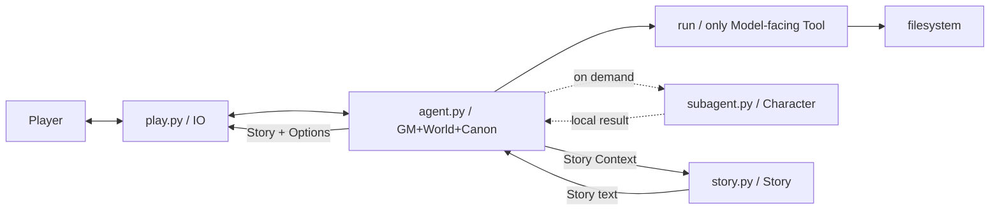
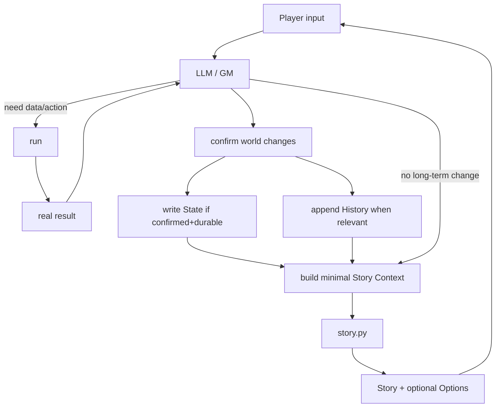

# RP-agent

```text
ROOT=~/RP-agent
DOC=Agent-only architecture contract

PRIORITY:
1 Canon / invariants
2 current task + current state
3 module responsibility
4 data contract
5 failure fallback
6 implementation detail

RULE: 只读取/维护会改变以上 1~5 的信息。
RULE: 代码是实现；本文件只保存模型不可遗忘的边界。
```

## 0. MENTAL MODEL



```text
agent.py    = 世界裁决者 / 唯一 Canon 提交者
story.py    = 写作器；只写，不裁决
subagent.py = 角色局部推演；只给局部结果
play.py     = IO；无世界判断
run         = Agent 唯一外部动作入口
filesystem  = 状态 / 资源 / 缓存
```

## 1. HARD BOUNDARY

```text
USER REQUEST     != WORLD FACT
CHARACTER RESULT != WORLD FACT
STORY TEXT       != WORLD FACT
OPTIONS          != WORLD FACT
MTP CANDIDATE    != WORLD FACT

Only:
真实世界操作结果 + GM确认
            ↓
          Canon
            ↓
         State.md
```

```text
Canon authority:
actual execution + GM confirm
> State
> Character dynamic result
> static Character/WorldBook
> History
> Summary
> inference
```

## 2. MAIN LOOP



```text
每轮：
前   read necessary facts
中   reason / run / verify
后   persist confirmed durable changes

State 无变化 => 不写
```

## 3. ATTENTION / CONTEXT

```text
暴露原则 = 按需 > 全量

默认注意范围：
current input
+ relevant State
+ necessary History/Summary
+ relevant Character/WorldBook
+ current Character result
+ Story task

不需要 => 不读
不影响当前决策 => 不暴露
禁止全库扫描 / 全量灌 Context
```

## 4. FILE CONTRACT

```text
character/*.md  = static character definition
worldbook/*.md  = static world resource
rp/<RP>/State.md
                  = confirmed durable world facts
rp/<RP>/History.md
                  = interaction continuity
rp/<RP>/Summary.md
                  = compressed history; NOT Canon
~/.cache/rp-agent/
                  = ephemeral Context / MTP cache
```

```text
目录.md = navigation only
read index → locate target → read target
never scan whole directory
```

## 5. STATE DISCIPLINE

```text
READ
→ use confirmed facts
→ observe actual changes
→ GM confirms
→ merge + rewrite State

State stores ONLY:
confirmed + durable + future-useful

Never store:
story / draft / speculation / options / MTP /
temporary scene / unconfirmed result
```

## 6. AGENT CONTRACTS

### agent.py

```text
OWNS:
world / Canon / RP lifecycle / State / History / Summary
Context assembly / Character dispatch / Story handoff / Options / MTP

MUST:
use run for external state/action
inspect real result
make world decisions in model space
commit only confirmed changes
```

### subagent.py

```text
INPUT  = character card + local necessary context + optional dynamic state
OUTPUT = local character behavior/result

DO:
role / speech / thought / emotion / local reaction

DO NOT:
write rp/
claim Canon
own world state

CALL ONLY when character-specific reasoning is useful.
No-card NPC => GM handles directly.
```

### story.py

```text
INPUT  = GM-provided Story Context + HAGENT_ASSETS
OUTPUT = player-visible Story

DO NOT:
world decision
Canon write
rp write
options decision
MTP logic
meta explanation
```

## 7. RUN

```text
run = only Model-facing Tool

Need info/action:
reason → run → inspect output → reason

Program helpers are implementation, not tools.
Dangerous commands use existing confirmation path.
Never bypass authorization.
```

```bash
cat rp/<RP>/State.md
cat >> rp/<RP>/History.md <<'__H__'
...
__H__
cat > rp/<RP>/State.md <<'__S__'
...
__S__
cat character/目录.md
cat character/<name>.md
cat worldbook/目录.md
cat worldbook/<name>.md
python3 ~/RP-agent/subagent.py --char ... --context ...
mkdir -p ~/.cache/rp-agent/context
```

## 8. STORY HANDOFF

```text
GM decides world
→ persist confirmed durable changes
→ construct one-shot Story Context
→ story.py
→ display Story
→ clear ephemeral Context
```

```text
# Current Input
# Confirmed State
# Confirmed World Changes
# Necessary History
# Necessary Summary
# Relevant Characters
# Relevant World Book
# Character Agent Results
# Story Task
[# Player Options]
```

```text
missing optional section = allowed
Context = snapshot, not memory
absent fact => do not invent from hidden state
```

## 9. OPTIONS

```text
agent.py owns Options
0..3, optional
suggestion only
not selected action
not Canon
never constrain free input

GM writes '# Player Options' at Context tail
→ agent strips before story.py
→ display after Story
```

## 10. MTP

```text
DEFAULT=OFF
OWNER=agent.py
story.py=ordinary writer

MTP = background display-cache, NOT world system

Story shown
→ async branch generation
→ cache
→ next input lookup
→ reuse ONLY when:
   same RP
   same State fingerprint
   input clearly matches candidate condition

uncertain => miss
State changed => miss
cache bad => miss
failure => never block main loop

MTP only replaces displayed Story.
Never enters Canon / State / History.
```

```text
cache = ~/.cache/rp-agent/story/<rp>.json
branches = 1..4 when enabled
```

## 11. PROMPT LAYER

```text
NSFW_LAYER
  ↓ exact same / fixed first / all 3 agents

agent.py:
NSFW_LAYER + GM_RUNTIME

story.py:
NSFW_LAYER + STORY_RUNTIME + HAGENT_ASSETS

subagent.py:
NSFW_LAYER + CHARACTER_PROMPT + character card
```

```text
HAGENT_ASSETS = one intact block
Do not split / summarize / normalize content.
Changed => recompute single SHA256.
```

## 12. HARD INVARIANTS

```text
I1  agent.py is the only Canon authority.
I2  story.py/subagent.py never write rp/.
I3  run is the only Model-facing Tool.
I4  Story derives from GM Context, not hidden world inference.
I5  Options/MTP never become Canon.
I6  State = confirmed durable facts only.
I7  ephemeral data stays under ~/.cache/rp-agent/.
I8  MTP failure never breaks main chain.
I9  MTP cannot cross RP or State version.
I10 play.py does no world reasoning.
I11 Program does not replace model world judgment.
I12 no DB/RAG/Vector/Manager/PlotDriver/BeatEngine/
    plot state machine/business tools/browser architecture/new Loop.
I13 P1-P5 / 前-中-后 = cognition protocols, NOT program states.
```

## 13. FAILURE FALLBACK

```text
story.py fail / empty
→ report failure
→ main chain continues
→ no fake Story success

GM misses Story Context
→ fallback = State + History tail
→ IO only; no world judgment

MTP branch fail
→ drop branch
MTP all fail
→ no cache
cache invalid / RP mismatch / State mismatch
→ ordinary generation

API transient failure
→ existing retry policy
→ then fail current round; never fabricate

compression persistence fail
→ do not advance persisted/session state
```

## 14. CHANGE ROUTING

```text
GM / RP lifecycle / Options
→ agent.py : GM_RUNTIME

State / History / Context / compression
→ agent.py

Character behavior
→ subagent.py : CHARACTER_PROMPT

Story behavior
→ story.py : STORY_RUNTIME / HAGENT_ASSETS

MTP
→ agent.py only

API / IO / launch
→ corresponding program layer
```

```text
先改现有模块/契约。
局部问题 ≠ 新系统。
```

## 15. CHANGE CHECK

```text
BEFORE
read DOC
+ inspect relevant code
+ locate current symbols/functions
+ never trust stale line numbers

AFTER
syntax
imports
asset verify
NSFW_LAYER equality/order
TOOLS == ["run"]
story.py has no MTP/predict interface
main path works
Canon boundaries unchanged
```

```bash
cd ~/RP-agent
python3 -c "import ast;[ast.parse(open(f,encoding='utf-8').read()) for f in ('agent.py','story.py','subagent.py','play.py')]"
python3 story.py --verify
python3 -c "import sys;sys.path.insert(0,'.');import agent,story,subagent;assert agent.NSFW_LAYER==story.NSFW_LAYER==subagent.NSFW_LAYER"
python3 -c "import sys;sys.path.insert(0,'.');import agent;assert [t['function']['name'] for t in agent.TOOLS]==['run']"
```

## 16. ONE-PAGE MODEL

```text
agent    = GM / Canon
story    = writing
subagent = character-local
play     = IO
run      = only tool

actual world result + GM confirm = Canon
State   = durable confirmed Canon
History = continuity
Summary = compression
Context = current attention window

read on demand
write only confirmed state
story never decides world
character never decides world
options never become action
MTP never becomes fact

code change:
preserve boundaries
reuse architecture
avoid speculative complexity
```
