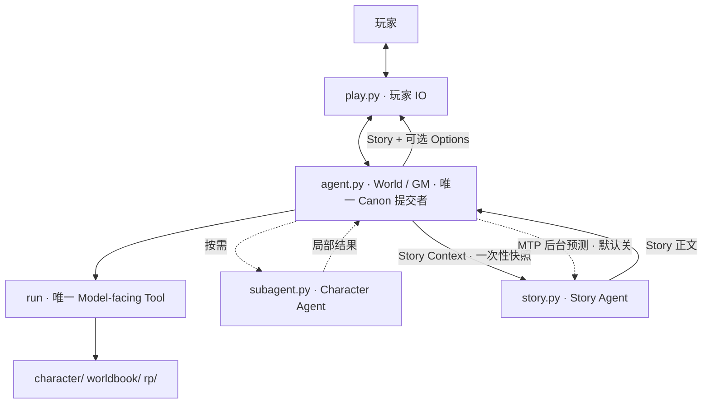
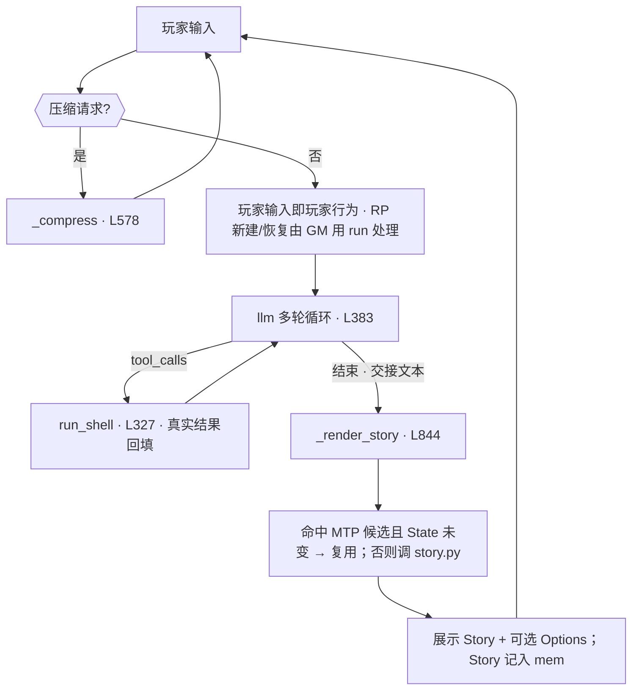
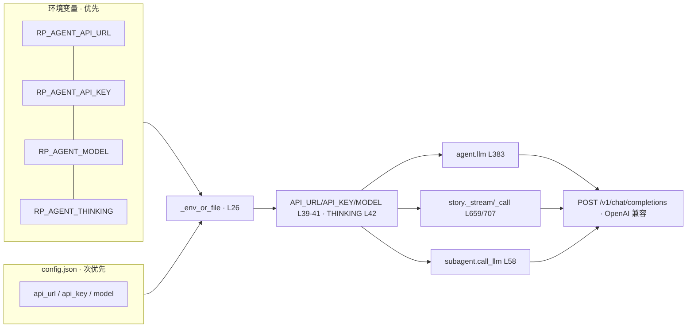
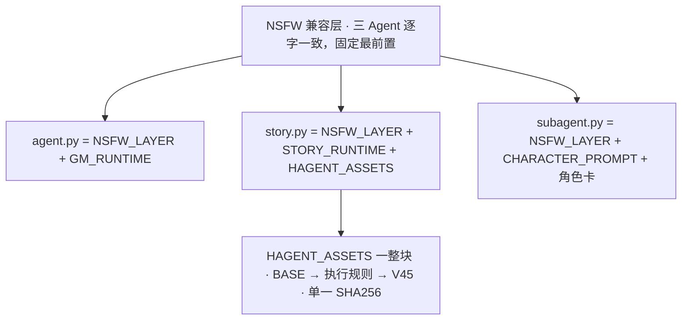

# RP-agent 架构文档（面向 Agent）

> 根目录 `~/RP-agent`（唯一正式运行根）。本文 = 代码锚点 + 数据契约 + 不变量 + 失败回退 + 改动定位。
> 行号以当前**无注释版**为准；改前先 `grep -n "^def \|^GM_RUNTIME\|^NSFW_LAYER" agent.py` 复核。
> **速查**：§2 索引 · §5 不变量 · §3/§13 契约 · §14 失败回退。

## 0. 架构与主循环





`mem` = `_session["mem"]`（仅进程内，不落盘）。玩家每次输入 = 一个交互单元；内部 run/推理不暴露（`RP_QUIET=1` 连思维链与 `[run]` 行都隐藏）。

## 1. 文件布局

```
~/RP-agent/
├── agent.py          World / GM / Canon（1017 行）
├── story.py          Story Agent + MTP（868 行）
├── subagent.py       Character Agent（130 行）
├── play.py           玩家 IO 薄壳
├── launch.sh         桌面启动 → exec play.py --quiet
├── install.sh        一键安装（FILES 含 story.py）
├── RP-agent.desktop  快捷方式模板（@INSTALL_DIR@ 占位）
├── DOC.md / README.md / LICENSE
├── character/        角色卡 *.md + 目录.md（按需 cat）
├── worldbook/        世界书 *.md + 目录.md（按需 cat）
└── rp/               运行状态：目录.md + <RP>/{State,History,Summary}.md
```

无 DB / RAG / 浏览器 / localStorage。文件系统即运行环境。

## 2. 结构索引（行号锚点）

### agent.py（1017 行）

| 区域 | 行 | 内容 |
|---|---|---|
| verify（委托 story） | 4 | `import story; story.verify()` |
| 路径配置 | 10-17 | BASE_DIR/CHAR_DIR/WORLD_DIR/RP_DIR + STORY_PY/STORY_CTX/MTP_DIR/MTP_CTX_DIR |
| 阈值 | 19-22 | MAX_TOK/MAX_OUT/REASONING_EFFORT/AUTH_TIMEOUT |
| API 配置 | 24-42 | CONFIG_FILE/_env_or_file/API_URL/API_KEY/MODEL/THINKING |
| DANGER_BL / 模块级 verify | 44-51 | 危险黑名单；51 处调用 verify() |
| **NSFW 兼容层** | 53-68 | `NSFW_LAYER`（三 Agent 逐字一致，固定最前置，禁改） |
| GM Runtime | 68-210 | GM_RUNTIME：ROLE/MUST/BEAT/BOOT/WORLD/STATE/CONTEXT/CHARACTER/WORLD_BOOK/RP/RUN/STORY_HANDOFF/OPTIONS |
| Prompt 组装 | 210 | build_gm_system() = NSFW_LAYER + GM_RUNTIME |
| 工具定义 | 216 | TOOLS（唯一 run） |
| 危险命令匹配 | 234 | _split_segs/_first_hit/match_danger |
| 授权交互 | 273 | _input_yn / confirm_block(295) |
| run 实现 | 327 | run_shell()：危险授权 + 600s 超时 + `_observe_rp` 观察 |
| LLM 调用 | 383 | llm()：流式/工具；`\x00` 中断；重试 10×3s |
| 目录硬边界 | 482 | ensure_rp_dirs / list_rps |
| QUIET / _log | 496 | 玩家模式 |
| 会话状态 | 502 | _session：mem/summaries/压缩标志/active_rp |
| Context / 压缩 | 510-610 | _sanitize_hist/_build_context/_observe_rp/_locate_active_rp/_append_summary/_compress |
| boot_help | 610 | 启动显示 |
| MTP 核心 | 617-778 | _mtp_count/_norm_text/_safe_name/_mtp_log/_state_fingerprint/_mtp_cache/_llm_once/_mtp_lookup/_schedule_mtp |
| 玩家选项 | 817-828 | _OPT_MARK/_split_options/_print_options（只展示，不入 Canon） |
| Story 钩子 | 778-918 | _last_user_input/_fallback_story_context/_clear_story_ctx/_render_story(844) |
| 主循环 | 918-末尾 | main() |

### story.py（899 行）

| 区域 | 行 | 内容 |
|---|---|---|
| 写作资产（五层结构块） | 17-121 | `HAGENT_ASSETS_SRC`/`HAGENT_ASSETS_SHA256`（**唯一**）/`HAGENT_ASSETS`（CORE→FLOW→STYLE→REFERENCE→CHECK，注入）/`HAGENT_DEFAULT_NARRATIVE`（数据资产，不注入，同受单一 SHA 覆盖） |
| verify | 575 | 单一 SHA256：sha256(HAGENT_ASSETS + HAGENT_DEFAULT_NARRATIVE) |
| 路径/配置 | 586-612 | BASE_DIR/CONFIG_FILE/CACHE_DIR/MAX_OUT/_cfg/API 三元组/THINKING（自带，不 import agent） |
| **NSFW 兼容层** | 612-627 | `NSFW_LAYER`（与 agent/subagent 逐字一致） |
| Story Runtime | 627-651 | STORY_RUNTIME：身份/边界/输入/输出 |
| Prompt 组装 | 651 | build_story_system() = NSFW_LAYER + STORY_RUNTIME + HAGENT_ASSETS |
| 流式调用 | 659-692 | _stream()（write） |
| 预测资产 | 692-707 | PREDICT_RUNTIME（候选 JSON 契约） |
| 预测调用 | 707-738 | _call()（非流式）/ _extract_json() |
| 参数/缓存 | 738-769 | _read_context/_env_count/_cache_path |
| write | 769-794 | run_write() |
| predict | 794-850 | run_predict()：concurrent.futures 并发 → 缓存 JSON |
| list | 850-870 | run_list() |
| 主循环 | 870-末尾 | main() |

### subagent.py（130 行）

| 区域 | 行 | 内容 |
|---|---|---|
| Character Prompt | 26-42 | CHARACTER_PROMPT（原样未改） |
| **NSFW 兼容层** | 42-58 | `NSFW_LAYER`（逐字一致） |
| LLM 调用 | 58 | call_llm()（非流式、无 tools、不发 thinking） |
| 主循环 | 93-末尾 | main()：sys_msg = NSFW_LAYER + CHARACTER_PROMPT + 角色卡 |

## 3. 接口契约



| 调用方 | 流式 | tools | thinking | 备注 |
|---|---|---|---|---|
| `agent.llm()` | ✅ | `run`（唯一） | 仅 `RP_AGENT_THINKING=1` | 带 `stream_options.include_usage`；`\x00` 中断 |
| `story._stream()` / `_call()` | ✅ / ❌ | 无 | 同上 | write 流式；predict 非流式 |
| `subagent.call_llm()` | ❌ | 无 | **从不发送** | 兼容最广端点 |

| 入口 | 命令 | 出口 | 失败码 |
|---|---|---|---|
| agent | `play.py [--quiet]` | stdout：Story + `[可选行动]` | — |
| story write | `story.py --context @f` | stdout：仅 Story 正文 | 2 无API / 3 无文件 / 4 空 / 5 调用失败 |
| story predict | `story.py --mode predict --context @f --cache id --count N --rp X --state-fingerprint H` | 缓存 JSON（stdout 静默） | 2/3/4/5 + 6 全分支失败 / 7 写缓存失败 |
| story list | `story.py --mode list --cache id` | stdout：候选摘要 | 1 缺参 |
| story verify | `story.py --verify` | stdout：OK | 非 0 = 资产被改 |
| subagent | `subagent.py --char 卡 --context JSON|@f [--char-state 动态]` | stdout：角色局部结果 | 1 |

| 环境变量 | 默认 | 作用 |
|---|---|---|
| `RP_AGENT_API_URL` / `_API_KEY` / `_MODEL` | 空（回退 `config.json`） | 任意 OpenAI 兼容端点 |
| `RP_AGENT_THINKING` | 空（关） | `1` 时发 `reasoning_effort`/`thinking` |
| `RP_QUIET` | 空 | `1` 隐藏思维链与 `[run]` 行 |
| `RP_AGENT_MTP_BRANCHES` | `0`（关） | 1–4：后台候选数 |

## 4. Prompt 分层



| Agent | 最终 system prompt | 注意力中心 |
|---|---|---|
| agent.py | `NSFW_LAYER` + `GM_RUNTIME` | 世界 / 事实 / 状态 / Context 准备 |
| story.py | `NSFW_LAYER` + `STORY_RUNTIME` + `HAGENT_ASSETS` | 当前 Context + 叙事资产 |
| subagent.py | `NSFW_LAYER` + `CHARACTER_PROMPT` + 角色卡 | 角色卡 + 局部 Context |

### 资产纪律

- 资产 = `HAGENT_ASSETS`（注入整块，L17-155）+ `HAGENT_DEFAULT_NARRATIVE`（数据，不注入）。
- **禁止**摘要 / 改写文字 / 改结构 / 改顺序；三引号内是**数据**，不得 strip / 注释清理 / 格式化。
- 改资产 → 重算**唯一** SHA256 写入 `HAGENT_ASSETS_SHA256`（L18），否则 `verify()` 启动即抛错。

## 5. 数据模型 / Canon / 不变量

| 文件 | 语义 | 写入者 | 读取时机 |
|---|---|---|---|
| `character/*.md` | 静态角色定义（头=摘要，代码块=chara_card_v2 JSON） | 人工 | 按需 cat |
| `worldbook/*.md` | 静态世界资源（JSON entries） | 人工 | 按需 cat |
| `rp/<RP>/State.md` | **已确认**长期世界事实（精简清单） | 仅 GM（run heredoc） | 每轮前 |
| `rp/<RP>/History.md` | 交互连续性（逐条追加） | 仅 GM（run `>>`） | 恢复时带尾 |
| `rp/<RP>/Summary.md` | 历史压缩链（`## Summary N` 追加，永不覆盖） | `_compress` 落盘成功后 | 按需 |

State 纪律（每次推进都适用，非新 Loop）：**前** 读 State → **中** 用已确认事实、发现变化 → **后** 提交确认变化；无变化不更新。
判定序：本轮实际世界运行 + GM 确认 > Confirmed State > Character 动态 > Asset > History > Summary > 推断。
当前指令 ≠ 事实：用户要求改变世界 ≠ 世界已改变；仅经本轮世界运行并由 GM 确认的变化才能写 State。

| # | 不变量 | 由谁保证 | 破坏信号 |
|---|---|---|---|
| I1 | 只有 agent.py 可确认 Canon | story/subagent 无 rp/ 写权限 | story 出现写 rp/ |
| I2 | story 所依据 Canon == GM 已确认 Canon | `_render_story` 用 GM 写的 Context | 程序臆造 Context |
| I3 | Options / MTP 候选 ≠ Canon | Options 只打印；候选只写 cache | State 含选项/候选文本 |
| I4 | `run` 是唯一 Model-facing Tool | `TOOLS == ["run"]` | 新增工具 |
| I5 | H-agent 资产逐字不变 + 单一 SHA256 | `verify()`（模块级） | verify 抛错 / SHA 变 |
| I6 | NSFW 层三处逐字一致且最前置 | `build_*_system().startswith(NSFW_LAYER)` | 回归 S21/S22 失败 |
| I7 | 临时数据不落 `rp/` | 全部在 `~/.cache/rp-agent/` | rp/ 出现非三件套 |
| I8 | MTP 任何失败不破坏主链 | daemon + DEVNULL + try/except + 日志 | 预测阻塞/抛出到主循环 |
| I9 | 候选不跨 State 版本 / 不跨 RP | cache 含 state_fp；按 RP 分文件；展示前二次校验 | 复用后与 State 冲突 |
| I10 | 程序不做世界判断 | 兜底 Context 只读 State + History 尾 20 行 | 程序里出现"是否发生"的 if |

## 6. Character Agent（subagent.py）


- 调用时机：角色对玩家独立回应且影响世界走向 / 立场·情绪·记忆的关键时刻 / 玩家直接对话。
- 无卡路人 NPC：GM 直接裁决，**不调** subagent。
- Character 输出 ≠ 世界事实；GM 是最终裁决者。

## 7. run 与文件操作

| 动作 | 命令模板 |
|---|---|
| 读 State | `cat rp/<RP>/State.md` |
| 追加 History | `cat >> rp/<RP>/History.md << 'EOF' … EOF` |
| 重写 State | `cat > rp/<RP>/State.md << 'EOF' … EOF`（先读旧 → 合并变更） |
| 写 Story Context | `mkdir -p ~/.cache/rp-agent/context && cat > ~/.cache/rp-agent/context/story-context.md << 'EOF' … EOF` |
| 定位角色 | `cat character/目录.md` → `cat character/<名>.md` |
| 定位世界书 | `cat worldbook/目录.md` → `cat worldbook/<名>.md` |
| 调 Character | `python3 ~/RP-agent/subagent.py --char … --context …` |

目录.md 只做导航；正文在具体文件。**禁止全库扫描**。

## 8. 关键约束（改代码勿破坏）

- `run` 唯一 Model-facing Tool；`ensure_rp_dirs`/`list_rps` 等是 Program implementation，非 Tool。
- 禁止新增：DB / RAG / Vector / Manager / PlotDriver / BeatEngine / 剧情状态机 / 专用业务 Tool / 浏览器架构 / 新 Loop。
- P1-P5、前-中-后 = Prompt 认知协议；**程序无 p1()…p5() 状态机**。
- 危险命令（DANGER_BL L44）由 `confirm_block`（L295）键盘授权；不得绕过。
- Program 不替模型判断世界；Prompt 不把世界决策写死成 if/then。
- `play.py` 无世界判断；`QUIET` 只影响输出可见性，不影响落盘。
- 改动后必须同步本 DOC 的 L 锚点（见 §9/§10）。

## 9. 验证命令（改动后必跑）

```bash
cd ~/RP-agent
python3 -c "import ast;[ast.parse(open(f,encoding='utf-8').read()) for f in ('agent.py','story.py','subagent.py','play.py')]"  # 语法
python3 -c "import sys;sys.path.insert(0,'.');import agent;agent.verify()"        # 资产（委托 story）
python3 story.py --verify                                                        # 资产直接校验
python3 -c "import sys;sys.path.insert(0,'.');import agent,story,subagent;print(agent.NSFW_LAYER==story.NSFW_LAYER==subagent.NSFW_LAYER)"  # 兼容层一致
python3 -c "import sys;sys.path.insert(0,'.');import agent,story;print(len(agent.build_gm_system()),len(story.build_story_system()))"        # 5329 / 5554
python3 -c "import sys;sys.path.insert(0,'.');import agent;print([t['function']['name'] for t in agent.TOOLS])"                              # ['run']
python3 ~/.config/term_agent/skill/rp-agent-mtp-fault-suite.py                    # 离线故障套件（32 项，0=全过）
printf '你好\n' | python3 play.py --quiet                                          # 启动冒烟（需 API）
```

验收锚点：`build_gm_system()` len = `5329`；`story.build_story_system()` len = `5554`；`HAGENT_ASSETS_SHA256` 唯一；三处 `NSFW_LAYER` 逐字一致。

## 10. 改动定位（任务 → 改哪）

| 任务 | 位置 |
|---|---|
| GM 行为/规则（RP 生命周期/Beat/Options） | GM_RUNTIME L68 |
| API 阈值 / THINKING | L19-22 / L42 |
| 危险命令表 | DANGER_BL L44 |
| run 能力 / 超时 | run_shell L327 |
| 流式 / tool 处理 | llm L383 |
| 主循环 / 压缩 | main L918 / _compress L578 |
| RP 定位 / Summary 持久化 | _observe_rp L535 / _locate_active_rp L543 / _append_summary L564 |
| Story 写作层 | story.py：STORY_RUNTIME L627 / build_story_system L651 / _stream L659 |
| Story 交接 | GM_RUNTIME [STORY_HANDOFF] L68 + _render_story L844 |
| MTP | _mtp_lookup L700 / _schedule_mtp L725 + story.run_predict L794 |
| NSFW 兼容层 | 三处 `NSFW_LAYER`（agent L53 / story L612 / subagent L42）——必须同步且逐字一致 |
| 玩家选项 | GM_RUNTIME [OPTIONS] L68 + _split_options L820 / _print_options L828 |
| 资产(重算 sha) | story：`HAGENT_ASSETS` L19 / `HAGENT_DEFAULT_NARRATIVE` L123 → 唯一 `HAGENT_ASSETS_SHA256` L18 |
| 加角色 / 世界书 | `character/<名>.md` + 登记目录 · `worldbook/<名>.md` + 登记目录 |

## 11. MTP 加速层（默认关）

定位：利用玩家阅读时间**后台**预生成下一轮候选。加速旁路，非世界系统。

- 开关 `RP_AGENT_MTP_BRANCHES`：**默认 0=关**，有效 1–4（建议 2–3）。
- 链路：Story 展示后 `_schedule_mtp` L725 起 daemon 线程 → `story.py --mode predict` → 写缓存。**当前 Story 不等候选**。
- 缓存 `~/.cache/rp-agent/story/<rp>.json`（每 RP 一份，覆盖写）；日志 `mtp.log`。
- 失败只记日志；上一轮未完成则本轮跳过；预测 tmp `~/.cache/rp-agent/context/predict-<rp>.md` 用毕即删。
- **候选复用**：每轮输入到达 → `_mtp_lookup` L700：① 显式单字符 A/B/C ② `_llm_once`（L684）严格判定「输入与 condition 相容」；不确定一律 none。前置：缓存 `rp` == 当前 RP 且 `source_state_fingerprint` == 当前 State 指纹（`_state_fingerprint` L646）。**展示前再校验一次**，本轮 State 变则放弃复用。
- 复用只替换**展示文本**；世界运行与 State/History 写入仍全由 agent.py 完成（I3/I9）。

## 12. NSFW 兼容层 + 玩家选项

- **NSFW 层**：`NSFW{allow,consent}` + `Word_Block` + `Core_Truth`，三处**逐字一致**、固定**最前置**；改一处必须三处同改。
- **Options（属 agent.py）**：GM 依已确认世界状态判断是否有行动分叉 → 0～3 条，可无；仅是建议（非 Canon、不代表已选择、不限制自由输入）；**MTP 预测分支 ≠ 选项**。
- 通道：GM 把 `# Player Options` 块写在 **Story Context 末尾** → `_split_options` L820 **剥离**（不进 story.py）→ `_print_options` L828 在 Story 后打印；无该块则零输出。

## 13. 数据结构契约

Story Context（GM 写，一次性快照，用毕即清）——`#` 分块，缺块 story.py 需容错：

```
# Current Input / # Confirmed State / # Confirmed World Changes / # Necessary History /
# Necessary Summary / # Relevant Characters / # Relevant World Book /
# Character Agent Results / # Story Task / [# Player Options]
```

MTP 缓存 JSON（story.predict 原子写 tmp→rename）：

```json
{"candidate_set_id":"<rp>-<ts>","rp":"<rp>","source_state_fingerprint":"<sha256>",
 "source_context_fingerprint":"<sha256>","created_at":<epoch>,
 "branches":[{"branch_id":"A","condition":"…","story":"…"}]}
```

指纹：`state_fp = sha256(normalize(State.md))`（agent 侧；normalize = 逐行 rstrip + 去首尾空行）；`context_fp = sha256(Context 文本)`（story 侧）。

## 14. 失败模式与回退（一律不静默）

| 失败 | 行为 |
|---|---|
| story.py 缺失 / 调用失败 / 空输出 | 打印 `[Story Agent …]`，返回 None；mem 记 GM 交接文本 |
| GM 未写 Story Context | 程序兜底 Context（只读 State + History 尾 20 行，纯 IO） |
| MTP 无 API / 分支失败 / 全失败 | 仅记 mtp.log；不写缓存（全失败 rc=6） |
| 缓存损坏 / `rp` 不符 / State 指纹不符 | 视作无候选 → 普通生成 |
| 命中但本轮 State 已变 | 放弃复用，记 mtp.log |
| API 429 / 超时 / 截断 | llm() 重试 10×3s；仍失败跳出本轮 |
| 危险命令 | confirm_block 键盘授权；拒绝则不执行 |
| 压缩落盘失败 | `_compress` 返回 None，session 不更新（可重试） |
