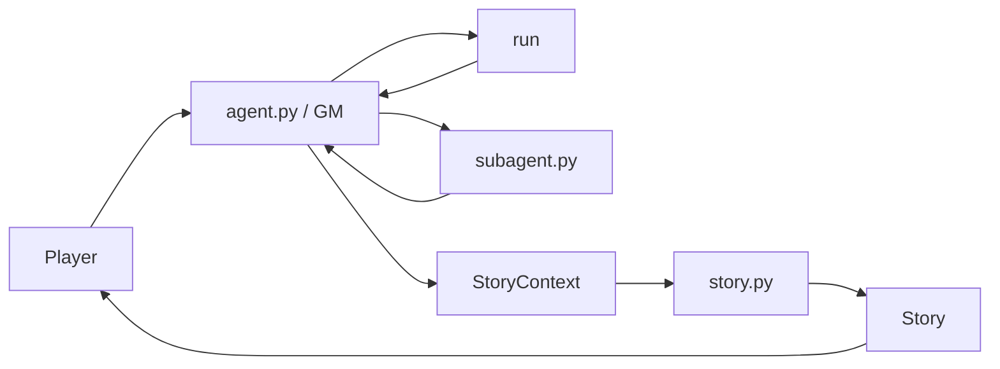
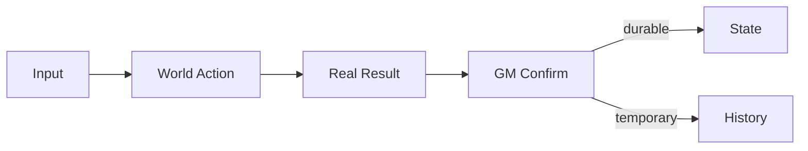
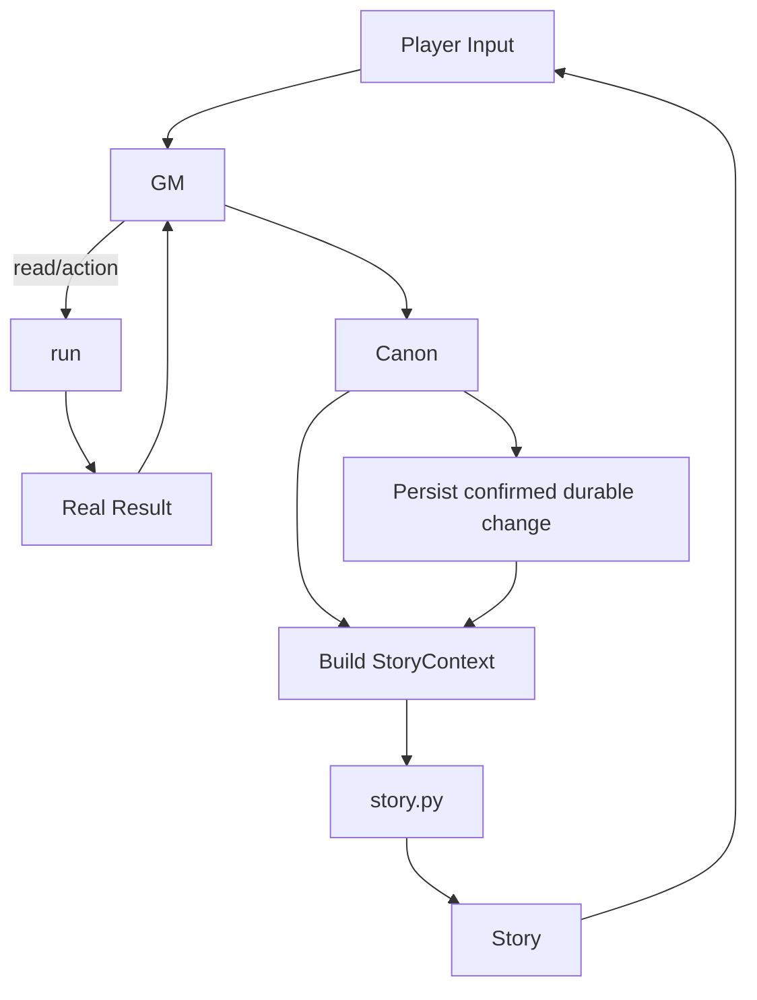
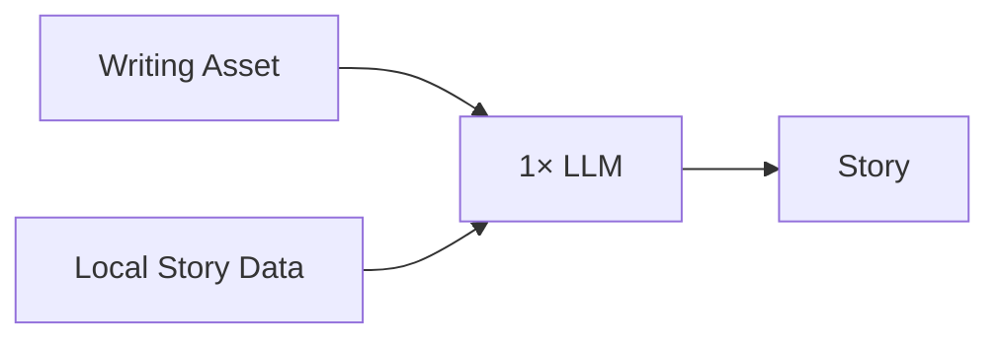
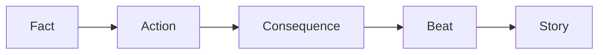

# RP-agent

```text
ROOT=~/RP-agent
TYPE=agent-contract
RULE=CODE implements; DOC defines boundaries.
```

## 0. CORE

```text
agent.py    = WORLD + GM + CANON + STATE
subagent.py = CHARACTER-LOCAL
story.py    = STATELESS WRITER
play.py     = IO
run         = ONLY MODEL-FACING TOOL

persistent = State / History / Summary
ephemeral  = Context / StoryContext / MTP
```



```text
WORLD  = what happened
CHAR   = what this character does
STORY  = how to write it
```

---

## 1. AUTHORITY

```text
USER_REQUEST     != FACT
CHARACTER_RESULT != FACT
STORY            != FACT
OPTIONS          != FACT
MTP_CANDIDATE    != FACT
```

```text
REAL_RESULT + GM_CONFIRM
        ↓
      CANON
        ↓
      STATE
```

```text
Authority:
REAL_RESULT+CONFIRM
> State
> CharacterResult
> Character/WorldBook
> History
> Summary
> inference
```

```text
ONLY agent.py:
  decide Canon
  write State
  write History
  write Summary

story.py:
  NEVER Canon
  NEVER State
  NEVER History
  NEVER Summary

subagent.py:
  NEVER Canon
  NEVER State
```

---

## 2. STATE

```text
S_t = durable confirmed world facts
H_t = interaction continuity
M_t = compressed history
```

```text
S_{t+1} =
    Merge(S_t, Canon_t)   if confirmed ∧ durable
    S_t                   otherwise
```

```text
State:
  confirmed + durable + future-useful

NOT State:
  draft
  speculation
  option
  temporary scene
  unconfirmed result
  Story
  MTP
```



---

## 3. LOOP



```text
READ → REASON → RUN → VERIFY → CANON → PERSIST → HANDOFF → WRITE
```

```text
State unchanged => no State write
Tool failed     => no fabricated success
```

---

## 4. RETRIEVAL

```text
R = all available resources
N_t = resources necessary for current decision
X_t = exposed resources
```

```text
N_t ⊆ X_t ⊆ R
minimize |X_t|
subject to N_t ⊆ X_t
```

```text
目录.md = INDEX
INDEX → LOCATE → READ TARGET
```

```text
NO:
  full scan
  full RP injection
  irrelevant preload

YES:
  need → read
  no need → skip
```

---

## 5. CHARACTER

```text
Z_t =
CharacterModel(
    Card,
    LocalContext,
    DynamicState?
)
```

```text
Z_t ∈
{
  thought,
  speech,
  emotion,
  reaction,
  local_action
}
```

```text
Z_t -> GM -> Canon
```

Never:

```text
Z_t -> State
```

---

## 6. STORY CONTEXT

```text
K_t =
min_sufficient(
    Input,
    ConfirmedState,
    ConfirmedChanges,
    NecessaryHistory?,
    NecessarySummary?,
    RelevantCharacter?,
    RelevantWorldBook?,
    CharacterResult?,
    StoryTask
)
```

```text
K_t != World
K_t != StateDump
K_t != FullHistory
K_t != Memory
K_t = one-shot writing interface
```

```text
Required ⊆ K_t ⊂ WorldInfo
```

```text
Missing required data => repair K_t
NOT:
  dump entire RP
```

---

## 7. WRITER

```text
A = WritingAsset
K_t = local StoryContext
Y_t = StoryModel(A, K_t)
```

```text
SYSTEM = A
USER   = K_t
OUTPUT = Y_t
```

```text
system != world memory
user   != hidden controller
```



---

## 8. ONE-SHOT

```text
A_t + K_t
   ↓
1× Fθ
   ↓
Y_t
   ↓
discard writer context
```

```text
Persistent:
  World State

Ephemeral:
  StoryContext

Stateless:
  Story generation
```

```text
NO:
  writer memory
  writer RP state
  writer long conversation
```

---

## 9. CONTEXT OBJECTIVE

```text
Q(K) = story quality
N(K) = irrelevant/noisy information
C(K) = context cost
L(K) = authority leakage
M(K) = missing required information
```

```text
J(K)
=
Q(K)
-
λN(K)
-
μC(K)
-
νL(K)
-
ρM(K)

λ, μ, ν, ρ > 0
```

Constraint:

```text
L(K)=0
M(K)=0
```

Target:

```text
max J(K)
```

therefore:

```text
more context != better
more useful context = better
```

---

## 10. DATA → OUTPUT

```text
Y ~ P(Y | A, K)
```

```text
A:
  controls expression

K:
  supplies current facts/data
```

```text
bad K           -> under-specification
relevant K      -> usable expression space
irrelevant K    -> noise
conflicting K   -> instability
```

```text
Quality ceiling:
Q_story ≤ Capacity(A, K, Model)
```

---

## 11. BEAT / FACT



```text
Beat != Event
Beat != Canon
Beat != StateDiff

Y -> WorldMutation = INVALID
B -> WorldEvent    = INVALID
```

---

## 12. OPTIONS

```text
O_t = optional action suggestions
O_t ⊆ PossibleActions(S_t)
```

```text
O_t != SelectedAction
O_t != Canon
O_t != State
```

```text
player may always provide I_t ∉ O_t
```

---

## 13. MTP

```text
DEFAULT=OFF
OWNER=agent.py
STATUS=optional prediction cache
```

```text
Y' = StoryModel(A, K')
```

```text
Valid(candidate)
=
SameRP
∧ SameStateFingerprint
∧ MatchCondition
∧ IntegrityOK
```

```text
invalid => miss => ordinary generation
uncertain => miss
MTP fail => main loop unchanged
```

```text
MTP candidate != Canon
MTP candidate != State
MTP candidate != History
```

```text
GM-FACING
SYSTEM     = capability semantics
STATUS_MSG = [MTP]/enabled/depth=N
EXPOSE     = enabled only
POSITION   = above real input

TRIGGER    = action/options fixed => fire-and-forget, block=no
```

---

## 14. FILE CONTRACT

```text
character/*.md          = Character definitions
worldbook/*.md          = World resources

rp/<RP>/State.md        = confirmed durable facts
rp/<RP>/History.md      = continuity
rp/<RP>/Summary.md      = compressed history

~/.cache/rp-agent/      = ephemeral cache/context
```

```text
filesystem = persistence
Context    = current working set
StoryCtx   = GM→Writer interface
```

---

## 15. TOOL CONTRACT

```text
run = only Model-facing Tool
```

```text
reason
→ run
→ inspect
→ reason
```

```text
not executed -> not true
not observed -> not true
failed      -> not success
```

Program helpers:

```text
implementation != Model-facing Tool
```

---

## 16. FAILURE

```text
Story fail
  -> report
  -> no fake Story
  -> main chain continues

MTP fail
  -> drop candidate
  -> ordinary generation

Cache mismatch
  -> miss
  -> ordinary generation

API fail
  -> retry policy
  -> failure if exhausted
  -> never fabricate

Persistence fail
  -> no false commit
```

---

## 17. PROMPT

```text
agent.py:
  NSFW_LAYER + GM_RUNTIME

story.py:
  NSFW_LAYER + STORY_RUNTIME + HAGENT_ASSETS

subagent.py:
  NSFW_LAYER + CHARACTER_PROMPT + RoleCard
```

```text
HAGENT_ASSETS:
  intact
  no summary
  no normalization
  no silent reorder

changed:
  recompute SHA256
```

---

## 18. EXPERIMENTAL PRIOR

```text
Prompt engineering:
  + left-tail optimization
  + median uplift
  + variance reduction
  -> effective
  -> plateau exists
```

```text
Context engineering:
  128 A/B
  -> no practical gain
  -> long-form AI-like style worsened
```

```text
DEFAULT:
  WritingAsset
  + minimal local data
  + clean context
  + one-shot generation
```

```text
NOT DEFAULT:
  full RP context
  writer memory
  repeated writer passes
  extra controller layers
```

---

## 19. FORMAL MODEL

```text
World:
S_{t+1}
=
T(S_t, I_t, A_t, R_t, Canon_t)

Character:
Z_t
=
C(Card_t, LocalContext_t, DynamicState_t?)

StoryContext:
K_t
=
MinimalSufficient(
  I_t,
  S_t,
  ΔS_t,
  H_t?,
  M_t?,
  Character_t?,
  WorldBook_t?,
  Z_t?,
  Task_t
)

Story:
Y_t
=
Fθ(A_write, K_t)

Options:
O_t
=
Suggest(S_t, I_t)

MTP:
Y'_t
=
Fθ(A_write, K'_t)
```

---

## 20. INVARIANTS

```text
I1  agent.py = only Canon authority
I2  story.py = stateless writer
I3  subagent.py = local character inference
I4  play.py = IO
I5  run = only Model-facing Tool

I6  State = confirmed ∧ durable facts
I7  History != Canon
I8  Summary != Canon
I9  CharacterResult != Canon
I10 Story != Canon
I11 Options != Canon
I12 MTP != Canon

I13 Story never writes State
I14 Character never directly writes State
I15 StoryContext rebuilt per round
I16 Context = minimal + sufficient + relevant
I17 Writer does not search global world
I18 Writer has no persistent world memory

I19 tool failure != success
I20 cache failure => ordinary path
I21 MTP failure != main-path failure
I22 unnecessary information => do not expose
I23 no new architecture without measured benefit
I24 one SYSTEM: GM / Summary / special tasks by input
I25 MTP status exposed iff enabled, above real input
```

---

## 21. CHANGE ROUTING

```text
World / Canon / State / History / Summary / Context
  -> agent.py

Character behavior
  -> subagent.py

Story behavior / writing assets
  -> story.py

IO / launch
  -> play.py / shell

MTP
  -> agent.py
```

```text
LOCAL PROBLEM
  -> EXISTING MODULE
  -> EXISTING CONTRACT
  -> SMALLEST CHANGE

NO:
  Manager
  Orchestrator
  PlotEngine
  StateEngine
  BeatEngine
  new Loop
  new business layer
  DB
  RAG
  Vector
```

---

## 22. VALIDATION

```bash
cd ~/RP-agent

python3 -c "import ast;[ast.parse(open(f,encoding='utf-8').read()) for f in ('agent.py','story.py','subagent.py','play.py')]"

python3 story.py --verify

python3 -c "import sys;sys.path.insert(0,'.');import agent,story,subagent;assert agent.NSFW_LAYER==story.NSFW_LAYER==subagent.NSFW_LAYER"

python3 -c "import sys;sys.path.insert(0,'.');import agent;assert [t['function']['name'] for t in agent.TOOLS]==['run']"
```

---

## 23. ONE-PAGE

```text
agent    = WORLD / CANON
subagent = CHARACTER-LOCAL
story    = WRITING
play     = IO
run      = TOOL

REAL RESULT + GM CONFIRM
→ CANON
→ STATE

READ ON DEMAND
→ MINIMAL SUFFICIENT CONTEXT
→ STORY
→ DISCARD

STATE    = PERSISTENT
CONTEXT  = EPHEMERAL
STORY    = STATELESS

WORLD    = WHAT HAPPENED
STORY    = HOW TO WRITE IT

NO CROSS-BOUNDARY AUTHORITY.
NO UNNECESSARY CONTEXT.
NO FABRICATED RESULTS.
NO SPECULATIVE ARCHITECTURE.
```

[1]: https://github.com/Xiyinnnnnn/RP-agent/blob/main/DOC.md "RP-agent/DOC.md at main · Xiyinnnnnn/RP-agent · GitHub"
