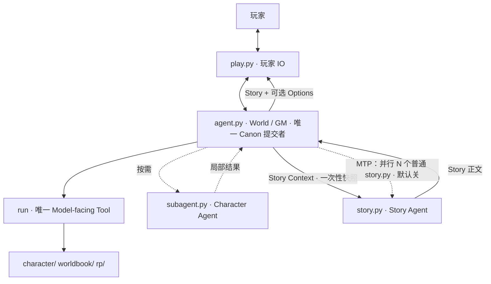
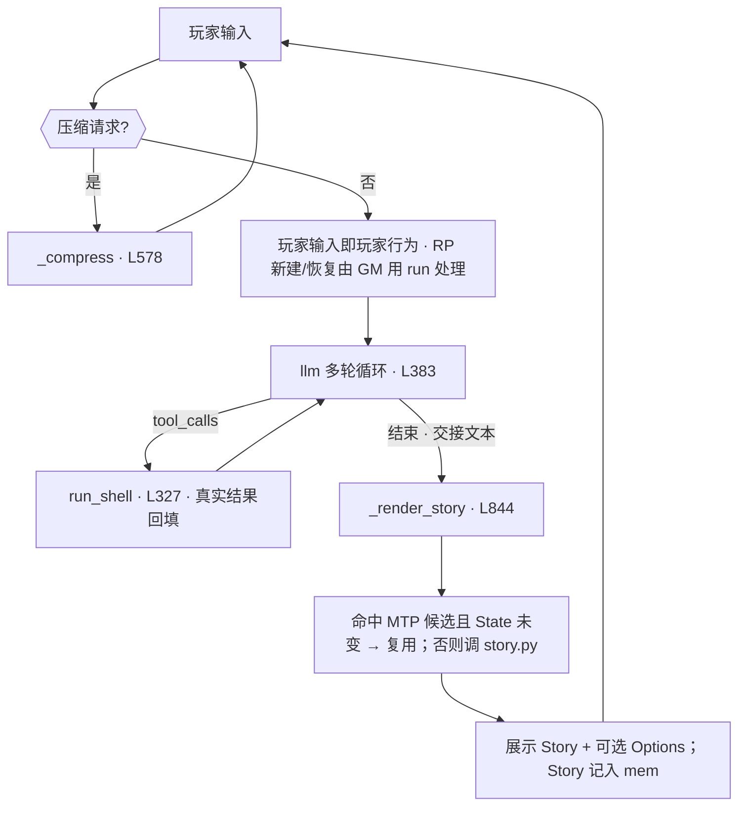
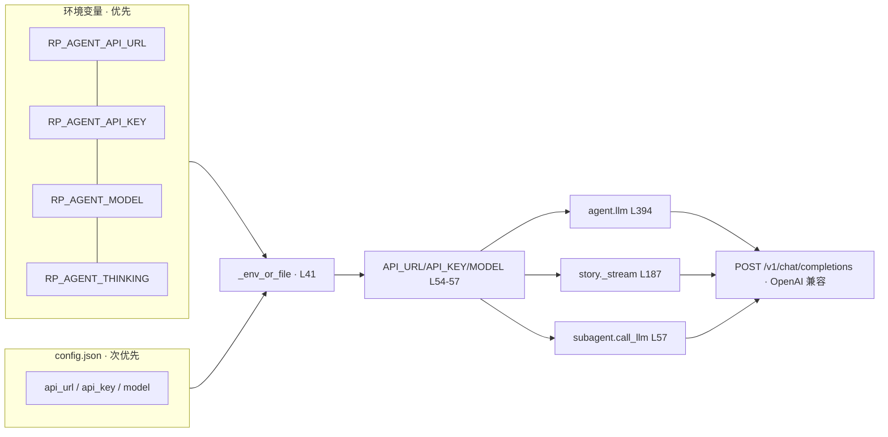
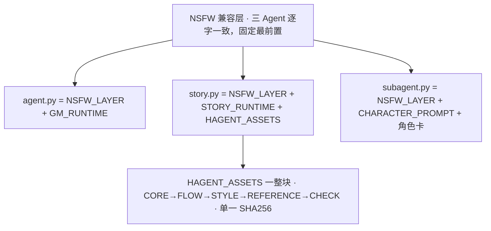

# RP-agent 架构文档（面向 Agent）

> 根目录 `~/RP-agent`（唯一正式运行根）。本文 = 代码锚点 + 数据契约 + 不变量 + 失败回退 + 改动定位。
> 行号以当前**无注释版**为准；改前先 `grep -n "^def \|^GM_RUNTIME\|^NSFW_LAYER" agent.py` 复核。
> **速查**：§2 索引 · §5 不变量 · §3/§13 契约 · §14 失败回退。

## 0. 架构与主循环





`mem` = `_session["mem"]`（仅进程内，不落盘）。玩家每次输入 = 一个交互单元；内部 run/推理不暴露（`RP_QUIET=1` 连思维链与 `[run]` 行都隐藏）。

## 1. 文件布局

```
~/RP-agent/
├── agent.py          World / GM / Canon + MTP 编排（1086 行）
├── story.py          Story Agent（纯写作，无 predict）（279 行）
├── subagent.py       Character Agent（129 行）
├── play.py           玩家 IO：单窗口运行 / --attach 剧情窗客户端
├── launch.sh         桌面双击 → 双窗口（tmux GM 会话 + 剧情窗）
├── install.sh        一键安装（FILES 含 story.py）
├── RP-agent.desktop  快捷方式模板（@INSTALL_DIR@ 占位）
├── DOC.md / README.md / LICENSE
├── character/        角色卡 *.md + 目录.md（按需 cat）
├── worldbook/        世界书 *.md + 目录.md（按需 cat）
└── rp/               运行状态：目录.md + <RP>/{State,History,Summary}.md
```

无 DB / RAG / 浏览器 / localStorage。文件系统即运行环境。

### 1.1 启动形态：双窗口（桌面双击）

```
[双击 RP-agent.desktop] → launch.sh
   ├─ tmux 会话（唯一状态持有者）        python3 agent.py   RP_AGENT_STORY_LOG=<镜像文件>
   ├─ 窗口① GM 控制台 = tmux attach      全量输出（[run]/思维链/状态行/Story），可直接输入
   └─ 窗口② 剧情窗   = play.py --attach  只显示 Story + [可选行动]；此处输入经 tmux send-keys 转交给会话
```

不变量：
- **State/History/Summary 只有一个写者** = tmux 会话里那一个 `agent.py`；窗口②是纯 IO 客户端，不碰 `rp/`。
- 剧情窗内容来源 = `RP_AGENT_STORY_LOG`（默认 `~/.cache/rp-agent/story-window.log`）：agent.py 把 Story 正文与选项镜像进去，窗口② tail 它。未设置该变量时 `_story_log()` 为空操作，单窗口行为逐字节不变。

| 开关 | 作用 |
|---|---|
| `RP_AGENT_1WIN=1` | 强制单窗口（`play.py --quiet`，旧行为） |
| 无 tmux / konsole / GUI 会话 | 自动回退单窗口 |
| `RP_AGENT_TMUX` | tmux 会话名（默认 `rp-agent`） |
| `RP_AGENT_STORY_LOG` | 剧情镜像文件路径 |
| `RP_AGENT_DRY=1` | 只打印将执行的命令 |

## 2. 结构索引（行号锚点）

> 行号以当前无注释版为准；改前先 `grep -n "^def \|^GM_RUNTIME\|^NSFW_LAYER" agent.py` 复核。

### agent.py（1086 行）

| 区域 | 行 | 内容 |
|---|---|---|
| verify（委托 story） | 4 | `import story; story.verify()` |
| 路径配置 | 10-20 | BASE_DIR/CHAR_DIR/WORLD_DIR/RP_DIR + STORY_PY/STORY_CTX/MTP_DIR/MTP_CTX_DIR |
| 阈值 | 34-37 | MAX_TOK/MAX_OUT/REASONING_EFFORT/AUTH_TIMEOUT |
| API 配置 | 39-57 | CONFIG_FILE/_env_or_file/API_URL/API_KEY/MODEL/THINKING |
| DANGER_BL | 59 | 危险黑名单 |
| **NSFW 兼容层** | 68 | `NSFW_LAYER`（三 Agent 逐字一致，固定最前置，禁改） |
| GM Runtime | 83-220 | GM_RUNTIME（ROLE/MUST/BEAT/BOOT/WORLD/STATE/CONTEXT/CHARACTER/WORLD_BOOK/RP/RUN/OUTPUT/STORY_HANDOFF/OPTIONS） |
| Prompt 组装 | 221 | build_gm_system() = NSFW_LAYER + GM_RUNTIME（len 5085） |
| 工具定义 | 227 | TOOLS（唯一 run） |
| 危险命令匹配 | 245 | _split_segs/_first_hit/match_danger |
| 授权交互 | 284 | _input_yn / confirm_block(306) |
| run 实现 | 338 | run_shell()：危险授权 + 600s 超时 + `_observe_rp` 观察 |
| LLM 调用 | 394 | llm()：流式/工具；`\x00` 中断；重试 10×3s |
| 目录硬边界 | 493 | ensure_rp_dirs / list_rps |
| QUIET / _log | 507 | 玩家模式 |
| 会话状态 | 513 | _session：mem/summaries/压缩标志/active_rp |
| Context / 压缩 | 521-620 | _sanitize_hist/_build_context/_observe_rp/_locate_active_rp/_append_summary/_compress |
| boot_help | 621 | 启动显示 |
| MTP 判定（agent 侧） | 628-656 | _mtp_count/_norm_text/_safe_name/_mtp_log/_state_fingerprint/_mtp_cache/_llm_once/_mtp_lookup |
| MTP 分支资产 + 生成 | 657-840 | MTP_BRANCH_RUNTIME/MTP_BRANCHES（程序侧，永不进 GM Prompt）+ _mtp_branch_ctx/_story_once/_schedule_mtp(768) |
| Story 钩子 | 841-879 | _last_user_input/_fallback_story_context/_clear_story_ctx/_render_story(908) |
| 玩家选项 | 880-985 | _OPT_MARK/_split_options/_print_options（只展示，不入 Canon） |
| 主循环 | 986-末尾 | main() |

### story.py（328 行）

| 区域 | 行 | 内容 |
|---|---|---|
| 写作资产（统一整块 · v3 B3T4） | 13-167 | HAGENT_ASSETS_SRC / `HAGENT_ASSETS_SHA256`（**唯一**）/ `HAGENT_ASSETS`（五层 CORE/FLOW/STYLE[BANS]/REFERENCE/CHECK + 末尾极短 Style Tail，注入） |
| verify | 168 | 单一 SHA256 = sha256(HAGENT_ASSETS) |
| 路径/配置 | 175-199 | BASE_DIR/CONFIG_FILE/MAX_OUT/_cfg/API 三元组/THINKING（自带，不 import agent） |
| **NSFW 兼容层** | 200-214 | `NSFW_LAYER`（与 agent/subagent 逐字一致） |
| Story Runtime | 215-227 | STORY_RUNTIME：角色/必须/输出（极薄，无架构解释） |
| Prompt 组装 | 228 | build_story_system() = NSFW_LAYER + STORY_RUNTIME + HAGENT_ASSETS（len 6751） |
| 流式调用 | 236 | _stream()（write） |
| Context / 写作 | 269-312 | _read_context() / run_write()（exit 1 缺参 / 2 无API / 3 无文件 / 4 空 / 5 调用失败） |
| CLI | 313-末尾 | main()：`--context` / `--max-tokens` / `--verify` —— **无 predict / 无 --mode** |

### subagent.py（129 行）

| 区域 | 行 | 内容 |
|---|---|---|
| Character Prompt | 26-40 | CHARACTER_PROMPT（只留角色任务所需：扮演当前角色/角色卡=定义/局部 Context/硬软限/只输出局部结果） |
| **NSFW 兼容层** | 41-56 | `NSFW_LAYER`（逐字一致） |
| LLM 调用 | 57 | call_llm()（非流式、无 tools、不发 thinking） |
| 角色卡解析 | 71 | extract_card_text()：`#`/`>` 头 + ```json 块（chara_card_v2） |
| 主循环 | 92-末尾 | main()：sys_msg = NSFW_LAYER + CHARACTER_PROMPT + 角色卡 |

## 3. 接口契约



| 调用方 | 流式 | tools | thinking | 备注 |
|---|---|---|---|---|
| `agent.llm()` | ✅ | `run`（唯一） | 仅 `RP_AGENT_THINKING=1` | 带 `stream_options.include_usage`；`\x00` 中断 |
| `story._stream()` | ✅ | 无 | 同上 | 只输出 Story 正文（无 predict 通道） |
| `subagent.call_llm()` | ❌ | 无 | **从不发送** | 兼容最广端点 |

| 入口 | 命令 | 出口 | 失败码 |
|---|---|---|---|
| agent | `play.py [--quiet]` / `play.py --attach` | stdout：全量 或 仅 Story+`[可选行动]`（同时镜像到 `RP_AGENT_STORY_LOG`） | — |
| story write | `story.py --context @f` | stdout：仅 Story 正文 | 1 缺参 / 2 无API / 3 无文件 / 4 空 / 5 调用失败 |
| story verify | `story.py --verify` | stdout：OK | 非 0 = 资产被改 |
| subagent | `subagent.py --char 卡 --context JSON\|@f [--char-state 动态]` | stdout：角色局部结果 | 1 |

> MTP 不在 story.py 的接口里：候选由 agent.py 自己编排（分支 Context + 并行普通 story.py），见 §11。

| 环境变量 | 默认 | 作用 |
|---|---|---|
| `RP_AGENT_API_URL` / `_API_KEY` / `_MODEL` | 空（回退 `config.json`） | 任意 OpenAI 兼容端点 |
| `RP_AGENT_THINKING` | 空（关） | `1` 时发 `reasoning_effort`/`thinking` |
| `RP_QUIET` | 空 | `1` 隐藏思维链与 `[run]` 行 |
| `RP_AGENT_MTP_BRANCHES` | `0`（关） | 1–4：后台并行 story.py 分支数 |

## 4. Prompt 分层



| Agent | 最终 system prompt | 注意力中心 |
|---|---|---|
| agent.py | `NSFW_LAYER` + `GM_RUNTIME` | 世界 / 事实 / 状态 / Context 准备 |
| story.py | `NSFW_LAYER` + `STORY_RUNTIME` + `HAGENT_ASSETS` | 当前 Context + 叙事资产 |
| subagent.py | `NSFW_LAYER` + `CHARACTER_PROMPT` + 角色卡 | 角色卡 + 局部 Context |

### 资产纪律

- 资产 = **单一** `HAGENT_ASSETS`（L13-118，注入整块，五层 CORE→FLOW→STYLE→REFERENCE→CHECK）。
- 旧 `HAGENT_DEFAULT_NARRATIVE`（数据块，从不注入）已于 2026-09-11「按需暴露」重构删除：其有效内容已被五层块覆盖，残留 `tool_usage_rules` 引用的 recall_context/world_queries 在本项目并不存在（幽灵工具，属应清理的历史遗留）。
- **禁止**为省 token 摘要 / 拆碎资产；三引号内是**数据**，不得 strip / 格式化。
- **v3 来源（2026-09-11 实验）**：`~/RP-agent/experiment/`（SCENE_SET_V1 12 场景；A 现资产 / B 心智重排 / B2 局部修正 / **B3T4 胜出**）× 真机 3 采样；胜出判据：同轮对决综合分 73.35 vs 69.94（p=0.080），12 项维度无一低于 A（二次元 +1.01、官能张力 +0.40、模板化 −0.21、节奏 +0.32）。
- 改资产 → 重算**唯一** SHA256 写入 `HAGENT_ASSETS_SHA256`（L14），否则 `verify()` 启动即抛错。

## 5. 数据模型 / Canon / 不变量

| 文件 | 语义 | 写入者 | 读取时机 |
|---|---|---|---|
| `character/*.md` | 静态角色定义（头=摘要，代码块=chara_card_v2 JSON） | 人工 | 按需 cat |
| `worldbook/*.md` | 静态世界资源（JSON entries） | 人工 | 按需 cat |
| `rp/<RP>/State.md` | **已确认**长期世界事实（精简清单） | 仅 GM（run heredoc） | 每轮前 |
| `rp/<RP>/History.md` | 交互连续性（逐条追加） | 仅 GM（run `>>`） | 恢复时带尾 |
| `rp/<RP>/Summary.md` | 历史压缩链（`## Summary N` 追加，永不覆盖） | `_compress` 落盘成功后 | 按需 |

State 纪律（每次推进都适用，非新 Loop）：**前** 读 State → **中** 用已确认事实、发现变化 → **后** 提交确认变化；无变化不更新。
判定序：本轮实际世界运行 + GM 确认 > Confirmed State > Character 动态 > Asset > History > Summary > 推断。
当前指令 ≠ 事实：用户要求改变世界 ≠ 世界已改变；仅经本轮世界运行并由 GM 确认的变化才能写 State。

| # | 不变量 | 由谁保证 | 破坏信号 |
|---|---|---|---|
| I1 | 只有 agent.py 可确认 Canon | story/subagent 无 rp/ 写权限 | story 出现写 rp/ |
| I2 | story 所依据 Canon == GM 已确认 Canon | `_render_story` 用 GM 写的 Context | 程序臆造 Context |
| I3 | Options / MTP 候选 ≠ Canon | Options 只打印；候选只写 cache | State 含选项/候选文本 |
| I4 | `run` 是唯一 Model-facing Tool | `TOOLS == ["run"]` | 新增工具 |
| I5 | 写作资产整块受单一 SHA256 保护（改内容必须同步重算 SHA） | `verify()`（模块级，story.py） | verify 抛错 / SHA 未同步 |
| I6 | NSFW 层三处逐字一致且最前置 | `build_*_system().startswith(NSFW_LAYER)` | 回归 S21/S22 失败 |
| I7 | 临时数据不落 `rp/` | 全部在 `~/.cache/rp-agent/` | rp/ 出现非三件套 |
| I8 | MTP 任何失败不破坏主链 | daemon + DEVNULL + try/except + 日志 | 预测阻塞/抛出到主循环 |
| I9 | 候选不跨 State 版本 / 不跨 RP | cache 含 state_fp；按 RP 分文件；展示前二次校验 | 复用后与 State 冲突 |
| I10 | 程序不做世界判断 | 兜底 Context 只读 State + History 尾 20 行 | 程序里出现"是否发生"的 if |

## 6. Character Agent（subagent.py）


- Prompt（L26）只含角色任务所需：扮演当前角色 / 角色卡=角色定义 / 局部 Context / 硬软限 / 只输出局部结果；不再解释 GM、State、审阅链等系统结构。
- 调用时机：角色对玩家独立回应且影响世界走向 / 立场·情绪·记忆的关键时刻 / 玩家直接对话。
- 无卡路人 NPC：GM 直接裁决，**不调** subagent。
- Character 输出 ≠ 世界事实；GM 是最终裁决者。

## 7. run 与文件操作

| 动作 | 命令模板 |
|---|---|
| 读 State | `cat rp/<RP>/State.md` |
| 追加 History | `cat >> rp/<RP>/History.md << 'EOF' … EOF` |
| 重写 State | `cat > rp/<RP>/State.md << 'EOF' … EOF`（先读旧 → 合并变更） |
| 写 Story Context | `mkdir -p ~/.cache/rp-agent/context && cat > ~/.cache/rp-agent/context/story-context.md << 'EOF' … EOF` |
| 定位角色 | `cat character/目录.md` → `cat character/<名>.md` |
| 定位世界书 | `cat worldbook/目录.md` → `cat worldbook/<名>.md` |
| 调 Character | `python3 ~/RP-agent/subagent.py --char … --context …` |

目录.md 只做导航；正文在具体文件。**禁止全库扫描**。

## 8. 关键约束（改代码勿破坏）

- `run` 唯一 Model-facing Tool；`ensure_rp_dirs`/`list_rps` 等是 Program implementation，非 Tool。
- 禁止新增：DB / RAG / Vector / Manager / PlotDriver / BeatEngine / 剧情状态机 / 专用业务 Tool / 浏览器架构 / 新 Loop。
- P1-P5、前-中-后 = Prompt 认知协议；**程序无 p1()…p5() 状态机**。
- 危险命令（DANGER_BL L44）由 `confirm_block`（L295）键盘授权；不得绕过。
- Program 不替模型判断世界；Prompt 不把世界决策写死成 if/then。
- `play.py` 无世界判断；`QUIET` 只影响输出可见性，不影响落盘。
- 改动后必须同步本 DOC 的 L 锚点（见 §9/§10）。

## 9. 验证命令（改动后必跑）

```bash
cd ~/RP-agent
python3 -c "import ast;[ast.parse(open(f,encoding='utf-8').read()) for f in ('agent.py','story.py','subagent.py','play.py')]"  # 语法
python3 -c "import sys;sys.path.insert(0,'.');import agent;agent.verify()"        # 资产（委托 story）
python3 story.py --verify                                                        # 资产直接校验
python3 -c "import sys;sys.path.insert(0,'.');import agent,story,subagent;print(agent.NSFW_LAYER==story.NSFW_LAYER==subagent.NSFW_LAYER)"  # 兼容层一致
python3 -c "import sys;sys.path.insert(0,'.');import agent,story;print(len(agent.build_gm_system()),len(story.build_story_system()))"        # 5085 / 6751
python3 -c "import sys;sys.path.insert(0,'.');import agent;print([t['function']['name'] for t in agent.TOOLS])"                              # ['run']
grep -c "predict\|PREDICT\|MTP" story.py                                        # 0（Story 不含预测/MTP 概念）
python3 story.py --help | grep -c -- "--mode"                                     # 0（CLI 只有 write/verify）
python3 ~/.config/term_agent/skill/rp-agent-mtp-fault-suite.py                    # 离线故障套件（39 项，0=全过）
printf '你好\n' | python3 play.py --quiet                                          # 启动冒烟（需 API）
```

验收锚点：`build_gm_system()` len = `5085`；`story.build_story_system()` len = `6751`；`HAGENT_ASSETS_SHA256` 唯一；三处 `NSFW_LAYER` 逐字一致；`story.py` 内 predict/PREDICT/MTP 出现次数 = 0。

## 10. 改动定位（任务 → 改哪）

| 任务 | 位置 |
|---|---|
| GM 行为/规则（RP 生命周期/Beat/Options） | GM_RUNTIME L83 |
| API 阈值 / THINKING | L34-37 |
| 危险命令表 | DANGER_BL L59 |
| run 能力 / 超时 | run_shell L338 |
| 流式 / tool 处理 | llm L394 |
| 主循环 / 压缩 | main L986 / _compress L589 |
| RP 定位 / Summary 持久化 | _observe_rp L546 / _locate_active_rp L554 / _append_summary L575 |
| Story 写作层 | story.py：STORY_RUNTIME L166 / build_story_system L179 / _stream L187 |
| Story 交接 | GM_RUNTIME [STORY_HANDOFF] L83 + _render_story L908 |
| MTP（全在 agent.py） | 判定 _mtp_lookup L728 / 分支资产 L657 / 生成 _schedule_mtp L768 |
| NSFW 兼容层 | 三处 `NSFW_LAYER`（agent L68 / story L151 / subagent L41）——必须同步且逐字一致 |
| 玩家选项 | GM_RUNTIME [OPTIONS] L83 + _split_options L883 / _print_options L891 |
| 资产(重算 sha) | story：`HAGENT_ASSETS` L15 → 唯一 `HAGENT_ASSETS_SHA256` L14 |
| 加角色 / 世界书 | `character/<名>.md` + 登记目录 · `worldbook/<名>.md` + 登记目录 |

## 11. MTP 加速层（默认关，**全部在 agent.py**）

定位：利用玩家阅读时间**后台**预生成下一轮候选。加速旁路，非世界系统。

- 开关 `RP_AGENT_MTP_BRANCHES`：**默认 0=关**，有效 1–4（建议 2–3）。
- **归属**：MTP 是 agent.py 的编排概念。story.py 只是**普通写作器**，被并行调用 N 次，不知道自己是分支、不知道候选缓存、不知道命中判定。
- 链路：Story 展示后 `_schedule_mtp`（L768）起 daemon 线程 → 为每个分支写一份分支 Context（本轮 Story Context + 程序侧走向指令 `MTP_BRANCH_RUNTIME` L657，走向表 `MTP_BRANCHES` L666）→ `ThreadPoolExecutor` 并行 `subprocess story.py --context @<分支文件>` → 收集正文 → 自组装候选 JSON 原子写。**当前 Story 不等候选**。
- 缓存 `~/.cache/rp-agent/story/<rp>.json`（每 RP 一份，覆盖写）；日志 `mtp.log`。
- 失败只记日志（分支失败丢弃该分支；全失败不写缓存）；上一轮未完成则本轮跳过；分支临时文件 `~/.cache/rp-agent/context/branch-<rp>-<id>.md` 用毕即删。
- **候选复用**：每轮输入到达 → `_mtp_lookup` L728：① 显式单字符 A/B/C/D ② `_llm_once`（L712）严格判定「输入与 condition（=走向指令）相容」；不确定一律 none。前置：缓存 `rp` == 当前 RP 且 `source_state_fingerprint` == 当前 State 指纹（`_state_fingerprint` L674）。**展示前再校验一次**，本轮 State 变则放弃复用。
- 复用只替换**展示文本**；世界运行与 State/History 写入仍全由 agent.py 完成（I3/I9）。

## 12. NSFW 兼容层 + 玩家选项

- **NSFW 层**：`NSFW{allow,consent}` + `Word_Block` + `Core_Truth`，三处**逐字一致**、固定**最前置**；改一处必须三处同改。
- **Options（属 agent.py）**：GM 依已确认世界状态判断是否有行动分叉 → 0～3 条，可无；仅是建议（非 Canon、不代表已选择、不限制自由输入）；MTP 候选只在命中时替换**展示文本**，从不作为选项、从不进 Canon。
- 通道：GM 把 `# Player Options` 块写在 **Story Context 末尾** → `_split_options` L883 **剥离**（不进 story.py）→ `_print_options` L891 在 Story 后打印；无该块则零输出。

## 13. 数据结构契约

Story Context（GM 写，一次性快照，用毕即清）——`#` 分块，缺块 story.py 需容错：

```
# Current Input / # Confirmed State / # Confirmed World Changes / # Necessary History /
# Necessary Summary / # Relevant Characters / # Relevant World Book /
# Character Agent Results / # Story Task / [# Player Options]
```

MTP 缓存 JSON（agent.py `_schedule_mtp` 组装，原子写 tmp→rename；story.py 不参与）：

```json
{"candidate_set_id":"<rp>-<ts>","rp":"<rp>","source_state_fingerprint":"<sha256>",
 "source_context_fingerprint":"<sha256>","created_at":<epoch>,
 "branches":[{"branch_id":"A","condition":"…","story":"…"}]}
```

指纹：`state_fp = sha256(normalize(State.md))`、`context_fp = sha256(Context 文本)`，**均在 agent 侧计算**（normalize = 逐行 rstrip + 去首尾空行）。

## 14. 失败模式与回退（一律不静默）

| 失败 | 行为 |
|---|---|
| story.py 缺失 / 调用失败 / 空输出 | 打印 `[Story Agent …]`，返回 None；mem 记 GM 交接文本 |
| GM 未写 Story Context | 程序兜底 Context（只读 State + History 尾 20 行，纯 IO） |
| MTP 分支失败 | 丢弃该分支，其余照常入缓存；不阻塞主链 |
| MTP 全部分支失败 | 不写缓存，仅记 mtp.log |
| 缓存损坏 / `rp` 不符 / State 指纹不符 | 视作无候选 → 普通生成 |
| 命中但本轮 State 已变 | 放弃复用，记 mtp.log |
| API 429 / 超时 / 截断 | llm() 重试 10×3s；仍失败跳出本轮 |
| 危险命令 | confirm_block 键盘授权；拒绝则不执行 |
| 压缩落盘失败 | `_compress` 返回 None，session 不更新（可重试） |
