# RP-agent

```text
RP-agent = World Runtime + Local Character Runtime + Stateless Story Writer

WORLD/GM
  负责：世界事实、因果、状态、历史、Canon、工具执行、Story Context

CHARACTER
  负责：单角色在当前局部情境下的内部判断/言语/行动/反应

STORY
  负责：把本轮已经确认、已经暴露的信息写成 Story 正文

权责边界：
  World/GM 不替 Story 写正文
  Story 不裁决世界、不写 State、不拥有长期记忆
  Character 不直接修改 World State
```

## 0. 系统总览

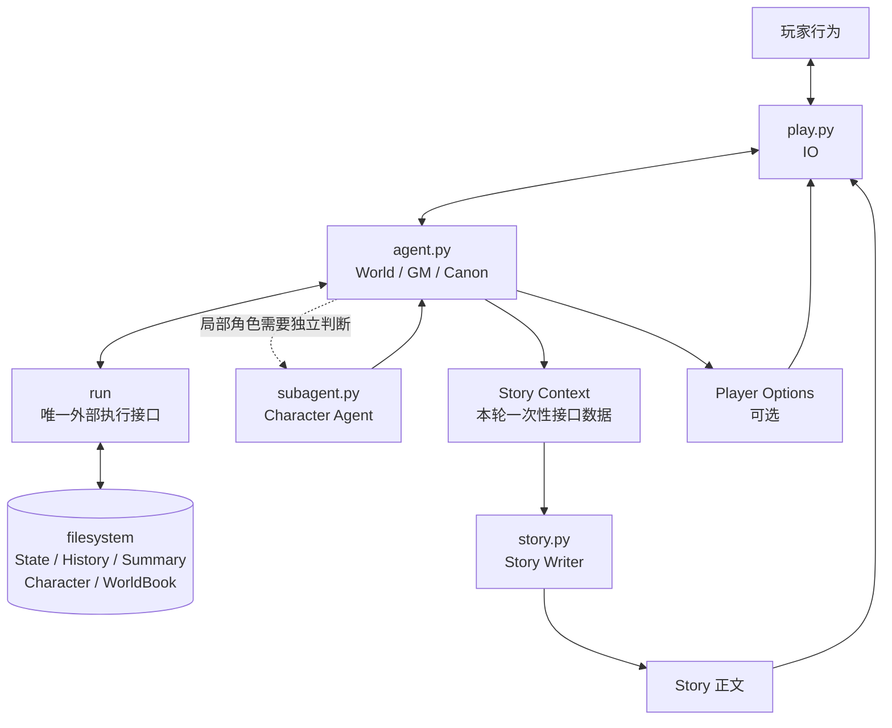

```text
核心不变量

1. 持久化发生在 World/GM 侧。
2. Story Context 是瞬时接口，不是长期记忆。
3. Story 每轮独立一次生成。
4. Story 不回写世界。
5. 玩家输入进入 World/GM；Story 只消费已交接数据。
6. 数据不足时宁缺，不越权补造世界事实。
```

## 1. 权责模型

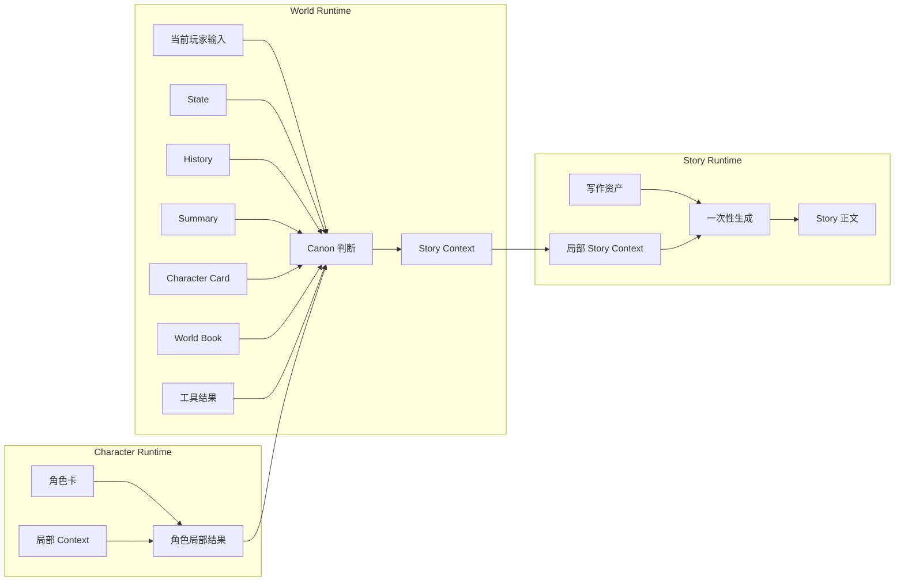

```text
权限矩阵

                    READ          WRITE         DECIDE
World State         GM            GM            GM
History             GM            GM            GM
Summary             GM            GM            GM
Character Card      GM/Character  filesystem    Character
World Book          GM/Writer*    filesystem    GM
Character Result    GM            Character     GM裁决
Story Context       Story         GM             GM
Story               Player        Story          Story

* Writer 只接收 GM 暴露的局部数据，不自行搜索世界资源。
```

## 2. 一轮运行

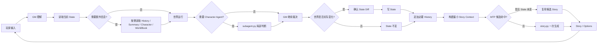

## 3. 世界运行环

```text
PLAYER
  ↓
INPUT
  ↓
READ CURRENT FACTS
  ↓
EXECUTE WORLD ACTION
  ↓
OBSERVE REAL RESULT
  ↓
GM CANON
  ↓
STATE DIFF?
 ├─ NO  → no State write
 └─ YES → State update
  ↓
HISTORY append when continuity requires
```

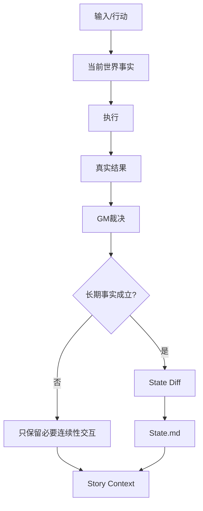

```text
State != Story

State：
  当前世界已经确认成立、需要长期保存的事实。

History：
  最近交互与已确认结果，用于连续性。

Summary：
  历史压缩，不是 Canon。

Story：
  表现结果，不自动成为 State。
```

## 4. 按需暴露

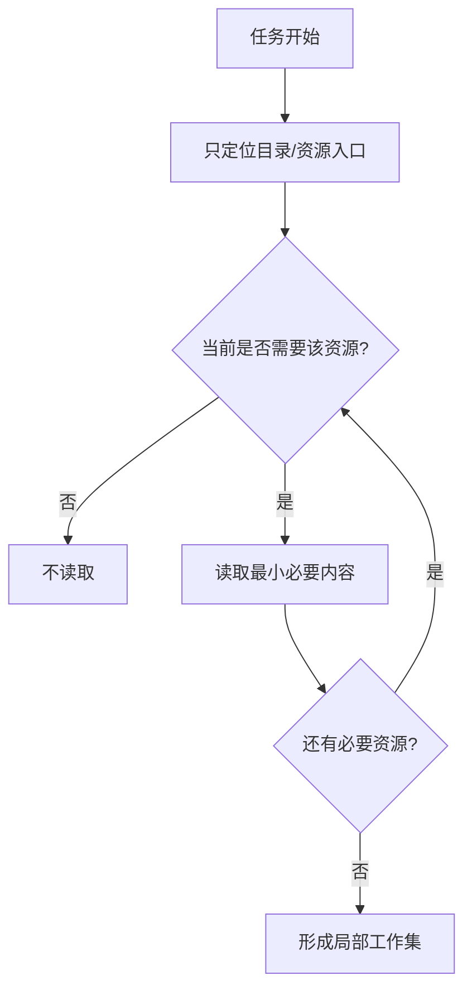

```text
禁止模式

startup
  -> 全角色
  -> 全世界书
  -> 全History
  -> 全Summary
  -> 全RP
  -> 全库扫描

正确模式

startup
  -> index
  -> identify
  -> read only needed
  -> run
```

```text
按需暴露 = 不是“越少越好”
按需暴露 = 当前任务的最小充分信息集

目标：
  minimize(unneeded context)
  subject to:
  enough(current decision)
```

## 5. Character Agent

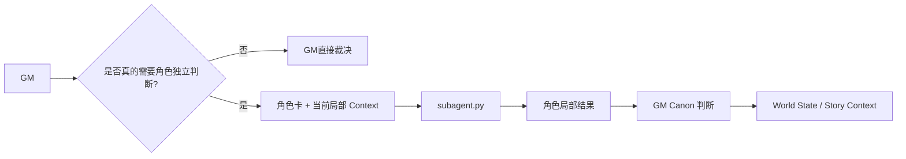

```text
Character Agent 输出
!= World State

Character Agent 只回答：
  此刻这个角色会怎么想
  此刻这个角色会怎么说
  此刻这个角色会怎么做
  此刻这个角色会有什么身体/情绪反应

GM 决定：
  是否真的发生
  是否影响世界
  是否形成长期事实
```

## 6. Story 接口

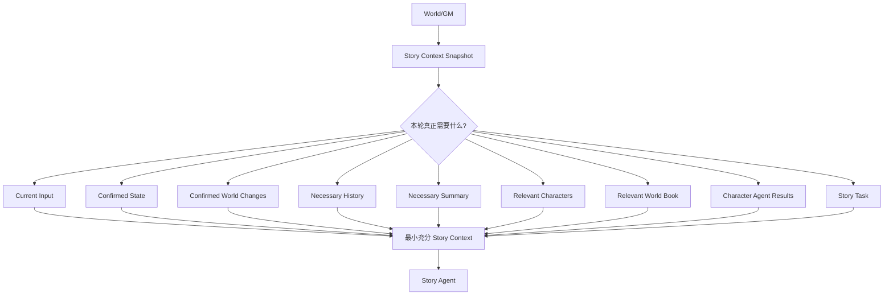

```text
Story Context 规则

只写：本轮写作必须知道的信息

不写：
  全仓库
  全部历史
  未确认剧情
  GM 推测
  无关角色
  无关世界书
  “暂无 / N/A / 无”占位
  Writer 不需要承担的世界管理信息
```

## 7. Story 生成边界

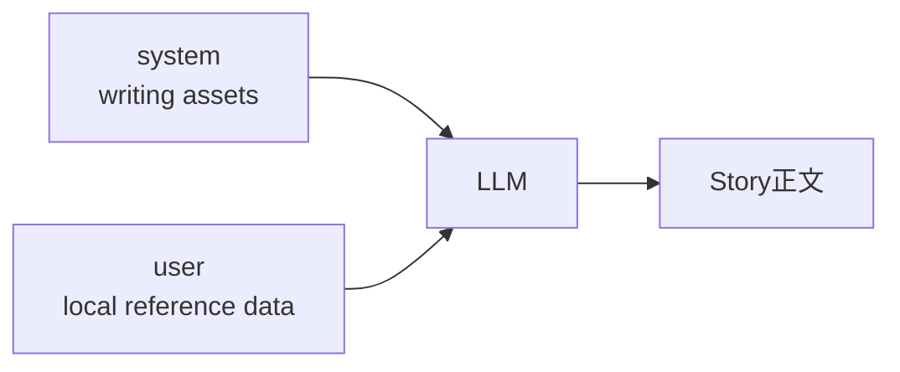

```text
SYSTEM
  = 写作资产
  = 稳定规则
  = 文风/结构/事实边界/输出格式

USER
  = 本轮预备数据
  = 当前场景
  = 已确认事实
  = 局部参考
  = 当前写作任务

OUTPUT
  = Story 正文
```

```text
重要：

system ≠ world memory
user   ≠ hidden controller
Story  ≠ GM

Writer 不因为“可能需要更多信息”而自行要求/搜索/构造世界。
Writer 不把写作判断升级成世界判断。
```

## 8. 一次性写作

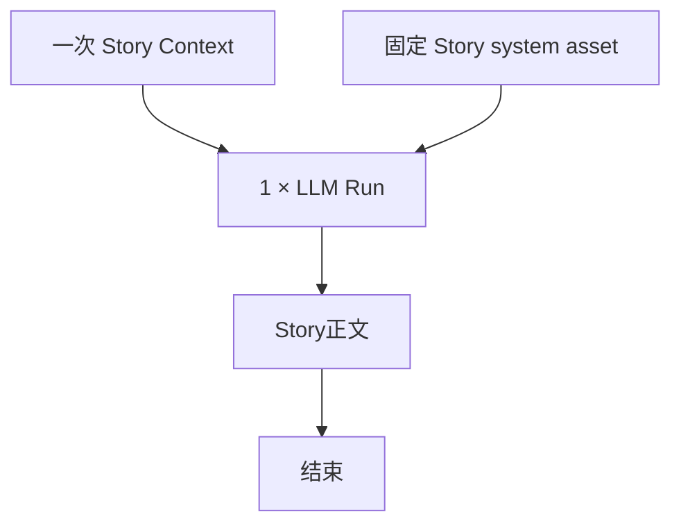

```text
每轮 Story：

new local context
      ↓
one model run
      ↓
one story output
      ↓
discard writer working context

跨轮持久化：
  World/GM filesystem

不持久化：
  Writer hidden memory
  Writer long conversation
  Writer self-generated world state
```

```text
本项目的“短上下文”不是简单压 token。

原则：
  clean context > long context
  local context > global context
  sufficient context > maximum context
  explicit data > inferred world state
```

## 9. Prompt 结构

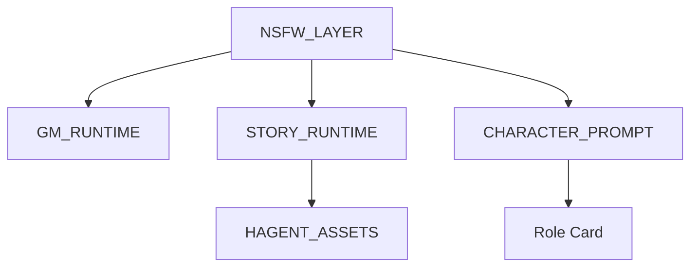

```text
agent.py
  NSFW_LAYER + GM_RUNTIME

story.py
  NSFW_LAYER + STORY_RUNTIME + HAGENT_ASSETS

subagent.py
  NSFW_LAYER + CHARACTER_PROMPT + Role Card
```

```text
Writer 侧的资产结构：

CORE
  ↓
FLOW
  ↓
STYLE
  ↓
REFERENCE
  ↓
CHECK
  ↓
output
```

```text
实验先验：

temperature=0.8
thinking=enabled
reasoning_effort=high
HAGENT_ASSETS=v5.1

但：
参数不是架构边界。
资产不是世界上下文。
```

## 10. 写作资产与输入数据

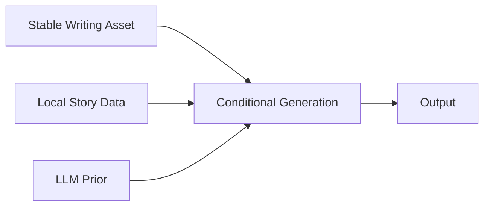

```text
输出质量受输入数据质量强烈约束：

bad data
  -> bad / underspecified output

rich but relevant data
  -> larger expression space

irrelevant data
  -> noise / competition / style drift

conflicting data
  -> unstable output
```

```text
所以：

“增加 Context”不是默认优化动作。
“增加有效数据”才可能提高可表达空间。
“增加无关数据”可能直接损害写作。
```

## 11. 数据流：完整

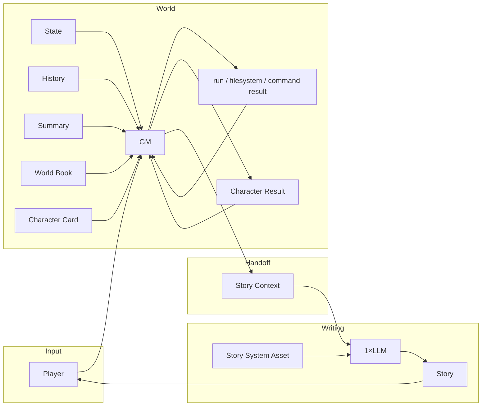

## 12. 数据流：不允许跨边界的回写

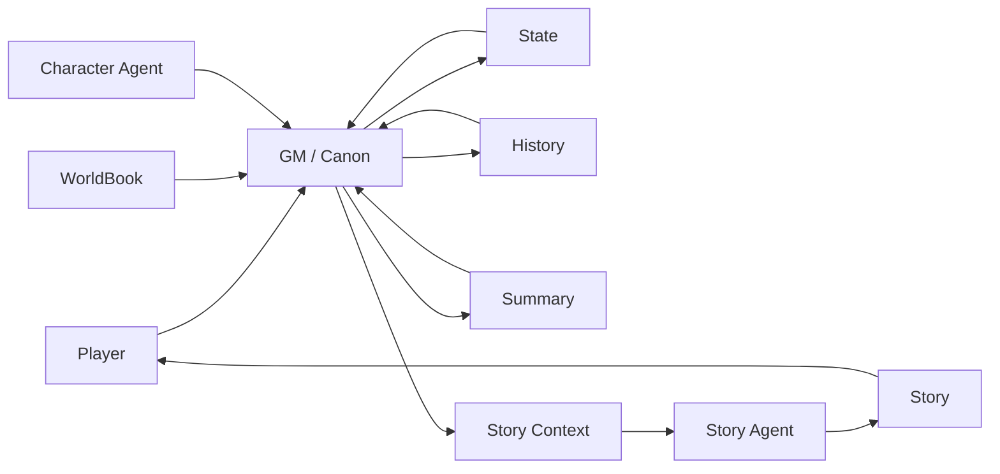

```text
合法因果链：

Player
  -> GM
  -> World execution
  -> GM Canon
  -> State
  -> Story Context
  -> Story

非法捷径：

Story
  -> State
Story
  -> Canon
Character Agent
  -> State
Story beat
  -> World event
```

## 13. Beat / Story / World

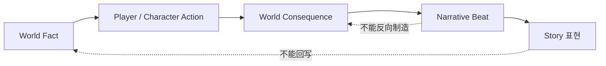

```text
Beat 是表现层参考。

Beat
  != World Command
  != Canon
  != State Diff
  != 必然发生事件

世界因果不支持下一 Beat：
  不推进 Beat
```

## 14. Player Options

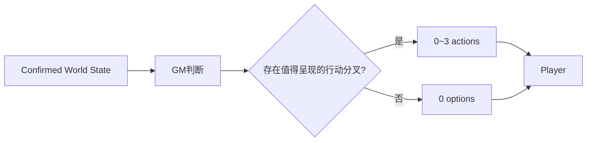

```text
Option
  = 行动建议
  != 已发生事实
  != Canon
  != 玩家已经选择
  != 强制剧情路线

玩家始终可以输入其他行动。
```

## 15. RP 生命周期

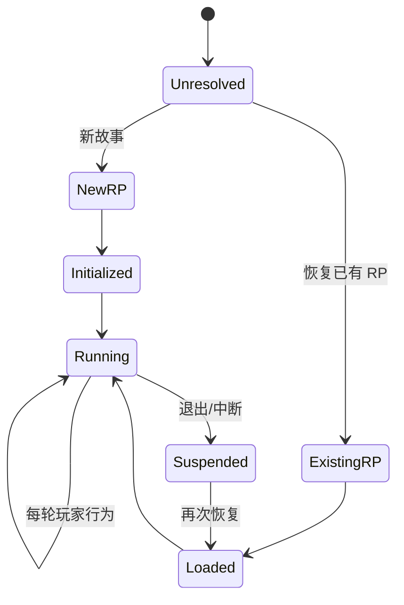

```text
RP/<name>/
  State.md
  History.md
  Summary.md
```

```text
新建
  create RP
  -> initialize files
  -> register index
  -> run

恢复
  locate RP
  -> read State
  -> read needed History/Summary
  -> continue
```

## 16. Story Cache / MTP

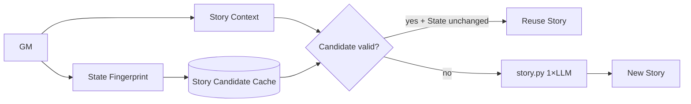

```text
MTP 是可选路径。
默认关闭。

复用条件的核心：
  Candidate 对应状态仍有效
  且当前交接条件匹配

MTP ≠ Writer 长上下文。
MTP ≠ Writer 记忆。
MTP 只是缓存/预测路径。
```

```text
GM 侧只暴露两件事：
  SYSTEM 中：MTP = 下一轮预计算的能力语义（预测不是事实）
  启用时：真实玩家输入正上方一条极简状态消息
          [MTP]
          enabled
          depth=N
触发时机：
  本轮玩家行动/选项确定后立即触发
  触发后不等待、不阻塞本轮（本轮照常 GM → Story）
关闭时：不注入任何 MTP 消息
```

## 17. 双窗口 IO

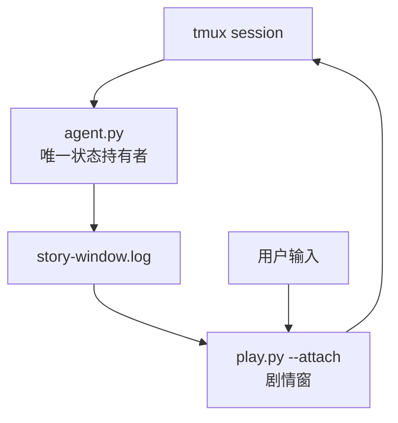

```text
窗口①
  = GM 控制台
  = 状态真实持有者

窗口②
  = Story 显示 + 输入转发
  = 不碰 State / History / Summary

核心不变量：
  一个 RP 状态只由一个 agent.py 进程持有。
```

## 18. 错误处理

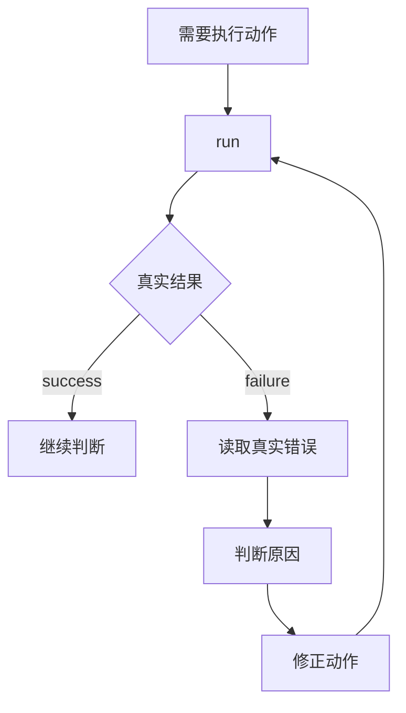

```text
禁止：
  未执行 -> 假定成功
  未读取 -> 假定文件存在
  API失败 -> 假定已生成
  工具失败 -> 当作世界结果
```

## 19. 文件系统模型

```text
~/RP-agent/
├── agent.py
├── story.py
├── subagent.py
├── play.py
├── launch.sh
├── install.sh
├── character/
│   └── *.md
├── worldbook/
│   └── *.md
└── rp/
    └── <RP>/
        ├── State.md
        ├── History.md
        └── Summary.md
```

```text
Filesystem
  = 外部持久状态
  = 可恢复状态
  = Agent 可执行世界记忆

Context
  = 本轮局部工作集

Story Context
  = GM → Writer 的最窄数据接口
```

## 20. 生成模型

```text
WORLD MODEL

persistent state
+ current input
+ local retrieval
+ world execution
+ canon
        │
        │ Story Context
        ▼
WRITER MODEL

writing assets
+ local reference data
        │
        │ 1× generation
        ▼
Story
```

```text
这是两个模型职责域的连接，不是共享意识。

World Runtime 负责：
  what happened

Story Runtime 负责：
  how to write it
```

## 21. Context 最小化模型

```text
C_t = minimal_sufficient(
    player_input,
    confirmed_state,
    confirmed_changes,
    necessary_history,
    necessary_summary,
    relevant_character_data,
    relevant_worldbook_data,
    character_results,
    story_task
)

Y_t = StoryModel(
    system = WritingAsset,
    user   = C_t
)
```

```text
C_t 不是完整世界。
C_t 不是历史镜像。
C_t 不是 Agent 内部状态转储。
C_t 是当前写作任务所需的最小充分接口数据。
```

## 22. 模型决策优先级

```text
WORLD SIDE

当前真实结果
  > 已确认 State
  > 明确当前玩家指令
  > 必要 History
  > 必要 Summary
  > Character / WorldBook
  > GM 推断
```

```text
STORY SIDE

本轮事实
  > 人物事实
  > 本轮任务
  > 当前场景
  > 写作资产
  > 可有可无的装饰
```

## 23. 设计不变量

```text
I1  World State 可持久化。
I2  Story Writer 不持久化长期记忆。
I3  Story Context 每轮重建。
I4  Context 按需暴露。
I5  Writer 不能裁决 Canon。
I6  Character Result 不能直接变 State。
I7  Beat 不能反向制造 World Event。
I8  Story 不能直接回写 World State。
I9  工具结果必须真实取得后才能继续。
I10 无长期变化则不更新 State。
I11 无必要信息则不读取。
I12 一轮 Story 默认一次模型生成。
```

## 24. 已验证的写作工程方向

```text
Prompt Engineering
  └─ 已证明有效：
       左尾优化
       中位数整体抬升
       稳定性改善

  └─ 已观察限制：
       明显平台期
       继续增加规则/层次不能无限突破
```

```text
Context Engineering
  └─ 128 A/B：负收益
       普遍无实际收益
       长文本场景 AI 味进一步恶化

结论：
  不把“更多上下文”当作默认质量优化器。
```

```text
因此当前方向：

prompt assets
    +
minimal local data
    +
clean context
    +
one-shot writing

而不是：

large context
    +
writer memory
    +
repeated writer passes
    +
extra controller layers
```

## 25. 架构压缩表达

```text
PLAYER
  ↓
WORLD/GM
  ↓
真实世界运行
  ↓
Canon / State
  ↓
minimal Story Context
  ↓
STORY WRITER
  ↓
one-shot prose
  ↓
PLAYER
```

```text
Persistent:
  World state

Ephemeral:
  Story Context

Stateless:
  Story generation

Authority:
  GM > Character Result
  facts > decoration
  current task > irrelevant preference
```

---

# Human

## 安装

```bash
bash <(curl -sL https://raw.githubusercontent.com/Xiyinnnnnn/RP-agent/main/install.sh)
```

## 免责条款

本项目仅提供软件框架与代码，不对生成内容、第三方模型服务、用户输入、用户配置或实际使用结果承担责任。用户应自行遵守所在地适用法律、法规以及所使用的平台和模型服务条款。

## 项目不提供预设资产

本项目不提供角色卡、世界书及其他 RP 预设资产。

## License

MIT License。

版权所有 © 2026 RP-agent contributors。

见 [LICENSE](LICENSE)。
