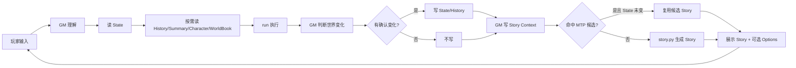
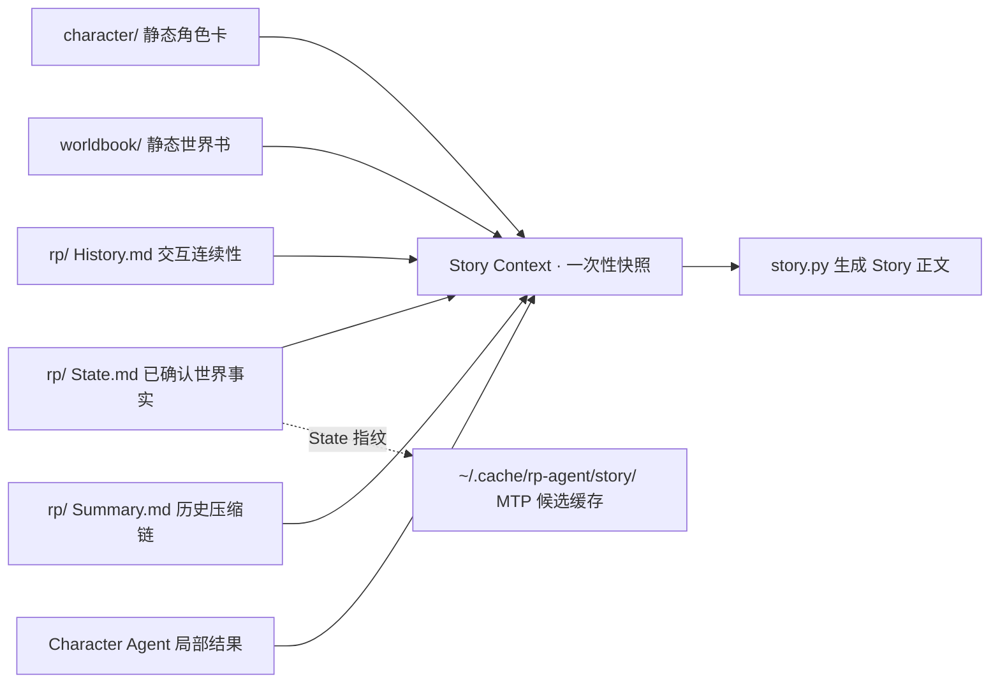
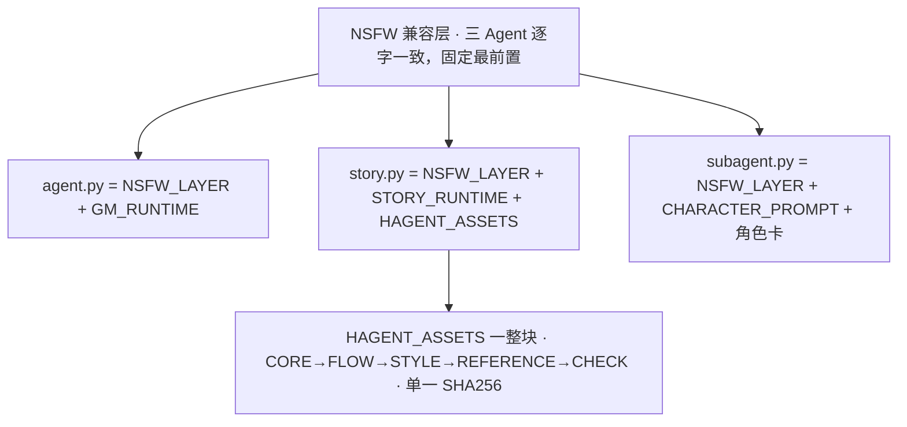

# RP-agent

终端 RP 框架

> 本项目是终端 RP（角色扮演）框架，内置提示词面向成人向 NSFW 场景。
> 请自行确认所在地法律与平台规则后再使用。

## 核心架构

```mermaid
flowchart TB
    P[玩家] <--> Play[play.py · 玩家 IO]
    Play <--> Agent[agent.py · World / GM · Canon]
    Agent --> Run[run · 唯一 Model-facing Tool]
    Run --> FS[character/ worldbook/ rp/]
    Agent -. 需要角色局部表现 .-> Sub[subagent.py · Character Agent]
    Sub --> Agent
    Agent -- Story Context --> Story[story.py · Story Agent]
    Story -- Story 正文 --> Agent
    Agent -. MTP：并行 N 个普通 story.py（默认关） .-> Story
    Agent -- Story + 可选 Options --> Play
```

## 主循环



## 数据模型



## Prompt 分层



## 职责分工

- `agent.py` — **World / GM**：世界运行、State/History、Canon 裁决
- `story.py` — **Story Agent**：把已确认世界写成 Story 正文
- `subagent.py` — **Character Agent**：单角色局部表现


### MTP 预生成（可选，默认关闭）

```bash
export RP_AGENT_MTP_BRANCHES=3   # 0=关闭（默认）；有效 1–4，建议 2–3
```

## 安装

```bash
bash <(curl -sL https://raw.githubusercontent.com/Xiyinnnnnn/RP-agent/main/install.sh)
```

零依赖。install.sh 复制文件 → 资产自检 → 可选建桌面快捷方式。

## 运行

```bash
bash ~/RP-agent/launch.sh
```

或 `python3 ~/RP-agent/play.py`。

API：任意 OpenAI 兼容 `/v1/chat/completions`。三选一注入。

```bash
export RP_AGENT_API_URL=http://<host>:<port>/v1/chat/completions
export RP_AGENT_API_KEY=<key>
export RP_AGENT_MODEL=<model>
```

或写 `~/RP-agent/config.json`：

```json
{ "api_url": "http://<host>:<port>/v1/chat/completions", "api_key": "<key>", "model": "<model>" }
```

环境变量优先于 config.json。

## 交互

`Ctrl+X` 压缩 · `Ctrl+D` 退出 · `Ctrl+Space` 停止输出。

其余输入即玩家行为，RP 新建/恢复/切换由 GM 自行处理。

## 目录

```
~/RP-agent/
├── agent.py          World/GM（世界运行、Canon、Story Context）
├── story.py          Story Agent（纯写作：Context + 写作资产 → 正文）
├── subagent.py       角色 Agent
├── play.py           玩家 IO（单窗口 / --attach 剧情窗）
├── launch.sh         启动（双窗口）
├── RP-agent.desktop  快捷方式模板
├── install.sh        安装
├── character/        角色卡 + 目录.md
├── worldbook/        世界书 + 目录.md
└── rp/               运行状态 + 目录.md
```

## 项目不提供预设资产

## LICENSE

见 [LICENSE](LICENSE)。
