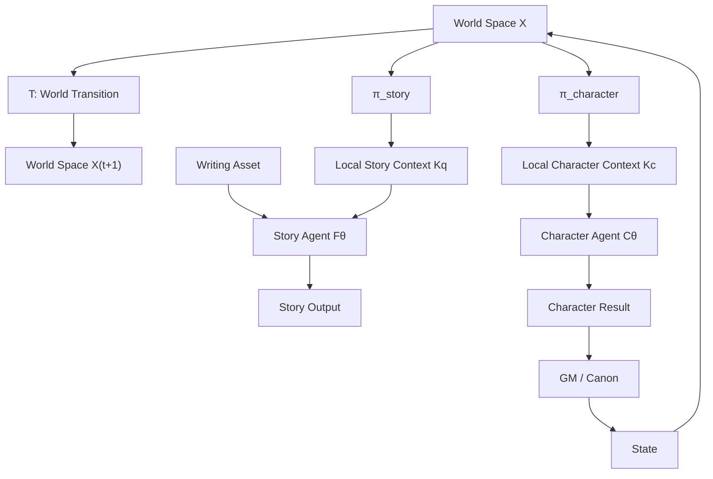

# RP-agent: Topological Model

## 0. Core Definition

```text
World Space:

X =
    State
  ∪ History
  ∪ Summary
  ∪ Character
  ∪ WorldBook
  ∪ Player
````

---

## 1. Dynamic World

```math
X(t+1) = T(X(t), I(t))
```

```text
Input
  |
  v
+-------+
| World |
+-------+
  |
  v
State(t+1)
```

---

## 2. Local Projection

```math
πq : X -> Kq
```

```text
Full World X

+--------------------------------+
| State                          |
| History                        |
| Character                      |
| WorldBook                      |
| Player                         |
|                                |
|        +---------------+       |
|        |  Context Kq   |       |
|        |  required q   |       |
|        +---------------+       |
|                                |
+--------------------------------+

X
 |
 | πq
 v

Kq
```

Optimization:

```math
min |Kq|

subject to:

Kq >= sufficient(q)
```

---

## 3. Equivalence Compression

```math
x1 ~q x2

iff

πq(x1) = πq(x2)
```

```math
Kq ≅ X / ~q
```

```text
World:

A ----\
       \
B -------> [same information state]
       /
C ----/

after πq
```

---

## 4. Story Generation

```math
Y(t) = Fθ(A, K(t))
```

```text
Writing Asset A
        |
        |
        v
+----------------+
| Story Function |
|      Fθ        |
+----------------+
        ^
        |
        |
 Local Context K

        |
        v

     Story Y
```

Constraint:

```math
Y does not write X
```

```text
Story
  |
  X
  |
State
```

invalid.

---

## 5. Character Model

```math
Z(t)=Cθ(πc(X(t)))
```

```text
World X

 |
 | πc
 v

Character Context

 |
 v

Character Agent

 |
 v

Character Result

 |
 v

GM Confirm

 |
 v

Canon
```

---

## 6. Authority Model

```text
                 World X

                    |
                    |
          +---------+---------+
          |                   |
          v                   v

 Character View          Story View

          |                   |
          v                   v

 Character Result          Story

          |
          |
          v

        GM

          |
          v

       Canon

          |
          v

        State
```

Allowed:

```text
GM -> Canon -> State
```

Forbidden:

```text
Story -> State

Character -> State

MTP -> State
```

---

## 7. Full Topological Graph



---

## 8. Complete Mathematical Model

```math
X(t+1)=T(X(t),I(t))
```

```math
K(t)=πq(X(t))
```

```math
Y(t)=Fθ(A,K(t))
```

```math
Z(t)=Cθ(πc(X(t)))
```

```math
Canon=Confirm(Z,R,G)
```

```math
State(t+1)=Merge(State(t),Canon)
```

---

## 9. Invariants

```math
Story ∩ State = ∅
```

```math
CharacterResult ≠ Canon
```

```math
Context ⊂ World
```

```math
WriterInput = MinimalSufficient(World,Task)
```

```math
World Authority = GM
```

---

## 10. Final Abstraction

```text
        GLOBAL WORLD

              |
              |
          Projection

              |
              |

      LOCAL INFORMATION

              |
              |

          Agent

              |
              |

          Output


Only:

Output -> World

is forbidden.

Only:

Canon -> World

is valid.
```

```
